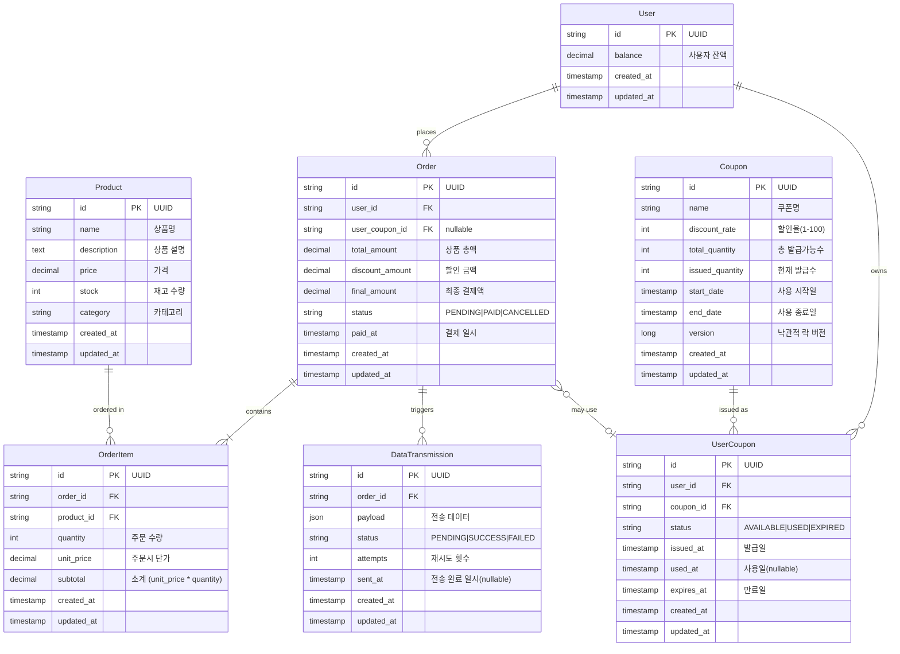

# 데이터베이스 스키마 문서

## Entity Relationship Diagram (ERD)



## 테이블 상세 설명

### 1. users
사용자 정보를 관리하는 테이블

| 컬럼명 | 타입 | 설명 | 제약조건 |
|--------|------|------|----------|
| id | VARCHAR | 사용자 ID | PK |
| balance | DECIMAL(10,2) | 잔액 | NOT NULL, DEFAULT 0 |
| created_at | TIMESTAMP | 생성일시 | NOT NULL |
| updated_at | TIMESTAMP | 수정일시 | NOT NULL |

**비즈니스 로직:**
- 잔액 충전: `chargeBalance(amount)`
- 잔액 차감: `deductBalance(amount)` - 잔액 부족 시 예외 발생

---

### 2. products
상품 정보를 관리하는 테이블

| 컬럼명 | 타입 | 설명 | 제약조건 |
|--------|------|------|----------|
| id | VARCHAR | 상품 ID | PK |
| name | VARCHAR | 상품명 | NOT NULL |
| description | TEXT | 상품 설명 | |
| price | DECIMAL(10,2) | 가격 | NOT NULL |
| stock | INT | 재고 수량 | NOT NULL |
| category | VARCHAR | 카테고리 | NOT NULL |
| created_at | TIMESTAMP | 생성일시 | NOT NULL |
| updated_at | TIMESTAMP | 수정일시 | NOT NULL |

**인덱스:**
- `idx_category`: (category)
- `idx_created_at`: (created_at)

**비즈니스 로직:**
- 재고 차감: `decreaseStock(quantity)` - 재고 부족 시 예외 발생
- 재고 복원: `increaseStock(quantity)`

---

### 3. orders
주문 정보를 관리하는 테이블

| 컬럼명 | 타입 | 설명 | 제약조건 |
|--------|------|------|----------|
| id | VARCHAR | 주문 ID | PK |
| user_id | VARCHAR | 사용자 ID | FK, NOT NULL |
| total_amount | DECIMAL(10,2) | 총 주문 금액 | NOT NULL |
| discount_amount | DECIMAL(10,2) | 할인 금액 | NOT NULL, DEFAULT 0 |
| final_amount | DECIMAL(10,2) | 최종 결제 금액 | NOT NULL |
| status | VARCHAR | 주문 상태 | NOT NULL, ENUM |
| paid_at | TIMESTAMP | 결제 완료 일시 | |
| created_at | TIMESTAMP | 생성일시 | NOT NULL |
| updated_at | TIMESTAMP | 수정일시 | NOT NULL |

**인덱스:**
- `idx_user_status`: (user_id, status)
- `idx_created_at`: (created_at)

**주문 상태 (OrderStatus):**
- `PENDING`: 주문 생성 완료, 결제 대기
- `PAID`: 결제 완료
- `CANCELLED`: 주문 취소

**비즈니스 로직:**
- 결제 완료 처리: `markAsPaid()` - PENDING → PAID
- 주문 취소: `cancel()` - PENDING → CANCELLED

---

### 4. order_items
주문 아이템 정보를 관리하는 테이블

| 컬럼명 | 타입 | 설명 | 제약조건 |
|--------|------|------|----------|
| id | VARCHAR | 주문 아이템 ID | PK |
| order_id | VARCHAR | 주문 ID | FK, NOT NULL |
| product_id | VARCHAR | 상품 ID | FK, NOT NULL |
| quantity | INT | 수량 | NOT NULL |
| unit_price | DECIMAL(10,2) | 단가 | NOT NULL |
| subtotal | DECIMAL(10,2) | 소계 | NOT NULL |
| created_at | TIMESTAMP | 생성일시 | NOT NULL |
| updated_at | TIMESTAMP | 수정일시 | NOT NULL |

**인덱스:**
- `idx_order_id`: (order_id)
- `idx_product_id`: (product_id)

**검증 로직:**
- `quantity > 0`
- `subtotal = unit_price × quantity`

---

### 5. coupons
쿠폰 마스터 정보를 관리하는 테이블

| 컬럼명 | 타입 | 설명 | 제약조건 |
|--------|------|------|----------|
| id | VARCHAR | 쿠폰 ID | PK |
| name | VARCHAR | 쿠폰명 | NOT NULL |
| discount_rate | INT | 할인율 (%) | NOT NULL |
| total_quantity | INT | 총 발급 수량 | NOT NULL |
| issued_quantity | INT | 발급된 수량 | NOT NULL, DEFAULT 0 |
| start_date | TIMESTAMP | 시작일시 | NOT NULL |
| end_date | TIMESTAMP | 종료일시 | NOT NULL |
| version | BIGINT | 버전 (낙관적 락) | NOT NULL |
| created_at | TIMESTAMP | 생성일시 | NOT NULL |
| updated_at | TIMESTAMP | 수정일시 | NOT NULL |

**인덱스:**
- `idx_dates`: (start_date, end_date)

**비즈니스 로직:**
- 발급 가능 여부: `canIssue()` - `issued_quantity < total_quantity`
- 쿠폰 발급: `issue()` - `issued_quantity++` (낙관적 락 사용)
- 유효성 검증: `isValid()` - 현재 시간이 시작/종료일 사이인지 확인

**동시성 제어:**
- `@Version`을 통한 낙관적 락 적용
- 동시 발급 시도 시 버전 충돌로 재시도 처리

---

### 6. user_coupons
사용자별 쿠폰 보유 정보를 관리하는 테이블

| 컬럼명 | 타입 | 설명 | 제약조건 |
|--------|------|------|----------|
| id | VARCHAR | 사용자 쿠폰 ID | PK |
| user_id | VARCHAR | 사용자 ID | FK, NOT NULL |
| coupon_id | VARCHAR | 쿠폰 ID | FK, NOT NULL |
| status | VARCHAR | 쿠폰 상태 | NOT NULL, ENUM |
| issued_at | TIMESTAMP | 발급일시 | NOT NULL |
| used_at | TIMESTAMP | 사용일시 | |
| expires_at | TIMESTAMP | 만료일시 | NOT NULL |
| created_at | TIMESTAMP | 생성일시 | NOT NULL |
| updated_at | TIMESTAMP | 수정일시 | NOT NULL |

**인덱스:**
- `idx_user_status`: (user_id, status)
- `idx_coupon_id`: (coupon_id)
- `idx_expires_at`: (expires_at)

**쿠폰 상태 (CouponStatus):**
- `AVAILABLE`: 사용 가능
- `USED`: 사용 완료
- `EXPIRED`: 만료됨

**비즈니스 로직:**
- 쿠폰 사용: `use()` - AVAILABLE → USED
- 쿠폰 복원: `restore()` - USED → AVAILABLE (만료된 경우 EXPIRED)
- 만료 확인: `isExpired()`, `checkExpired()`

**중복 발급 방지:**
- (user_id, coupon_id) 조합으로 중복 체크

---

### 7. data_transmissions
외부 시스템으로의 데이터 전송 이력을 관리하는 테이블 (Outbox Pattern)

| 컬럼명 | 타입 | 설명 | 제약조건 |
|--------|------|------|----------|
| id | VARCHAR | 전송 ID | PK |
| order_id | VARCHAR | 주문 ID | FK, NOT NULL |
| payload | JSON | 전송 데이터 | NOT NULL |
| status | VARCHAR | 전송 상태 | NOT NULL, ENUM |
| attempts | INT | 재시도 횟수 | NOT NULL, DEFAULT 0 |
| sent_at | TIMESTAMP | 전송 완료 일시 | |
| created_at | TIMESTAMP | 생성일시 | NOT NULL |
| updated_at | TIMESTAMP | 수정일시 | NOT NULL |

**인덱스:**
- `idx_status_created`: (status, created_at)
- `idx_order_id`: (order_id)

**전송 상태 (TransmissionStatus):**
- `PENDING`: 전송 대기
- `SUCCESS`: 전송 성공
- `FAILED`: 전송 실패

**비즈니스 로직:**
- 전송 성공: `markAsSuccess()` - status = SUCCESS, sent_at 기록
- 전송 실패: `markAsFailed()` - attempts++, status = FAILED
- 재시도 가능 여부: `canRetry()` - attempts < 3 && status != SUCCESS
- 재시도: `retry()` - attempts++, status = PENDING

**Outbox Pattern:**
- 주문이 PAID 상태로 변경될 때 레코드 생성
- 배치/스케줄러로 PENDING/FAILED 상태 레코드 조회 후 재전송
- 최대 3회 재시도 (지수 백오프: 1분, 5분, 15분)

---

## 주요 관계 (Relationships)

### 1. User ↔ Order (1:N)
- 한 사용자는 여러 주문을 생성할 수 있음
- Cascade: ALL (사용자 삭제 시 주문도 삭제)

### 2. User ↔ UserCoupon (1:N)
- 한 사용자는 여러 쿠폰을 보유할 수 있음
- Cascade: ALL (사용자 삭제 시 쿠폰도 삭제)

### 3. Order ↔ OrderItem (1:N)
- 한 주문은 여러 상품 아이템을 포함할 수 있음
- Cascade: ALL (주문 삭제 시 아이템도 삭제)

### 4. Order ↔ DataTransmission (1:N)
- 한 주문은 여러 전송 이력을 가질 수 있음 (재시도 케이스)
- Cascade: ALL (주문 삭제 시 전송 이력도 삭제)

### 5. Product ↔ OrderItem (1:N)
- 한 상품은 여러 주문 아이템에 포함될 수 있음
- Fetch: LAZY (성능 최적화)

### 6. Coupon ↔ UserCoupon (1:N)
- 한 쿠폰은 여러 사용자에게 발급될 수 있음
- Cascade: ALL (쿠폰 삭제 시 사용자 쿠폰도 삭제)

---

## 동시성 제어

### 1. 재고 관리 (Product)
- **낙관적 락(Optimistic Lock)** 사용 (향후 추가 예정)
- 재고 차감 시 동시 접근 제어
- 재시도 정책: 최대 3회, 100ms 간격

### 2. 쿠폰 발급 (Coupon)
- **낙관적 락(Optimistic Lock)** 사용 (`@Version`)
- `issued_quantity` 증가 시 버전 충돌 체크
- 선착순 발급 보장

---

## 금액 계산 공식

```kotlin
// 주문 아이템별 소계
subtotal = unitPrice × quantity

// 총 주문 금액
totalAmount = Σ(subtotal)

// 할인 금액 (내림 처리)
discountAmount = totalAmount × (discountRate / 100) [소수점 내림]

// 최종 결제 금액
finalAmount = totalAmount - discountAmount
```

---

## 상태 전이 다이어그램

### Order 상태 전이
```
PENDING (주문 생성)
   ↓
   ├─→ PAID (결제 성공) → DataTransmission 생성
   └─→ CANCELLED (결제 실패 또는 취소)
```

### UserCoupon 상태 전이
```
AVAILABLE (발급)
   ↓
   ├─→ USED (사용)
   │     ↓
   │   AVAILABLE (복원, 만료 전)
   │     ↓
   └─→ EXPIRED (만료)
```

### DataTransmission 상태 전이
```
PENDING (생성)
   ↓
   ├─→ SUCCESS (전송 성공)
   └─→ FAILED (전송 실패)
         ↓
       PENDING (재시도, 최대 3회)
         ↓
       FAILED (최종 실패)
```