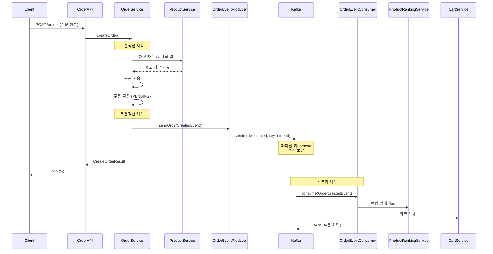
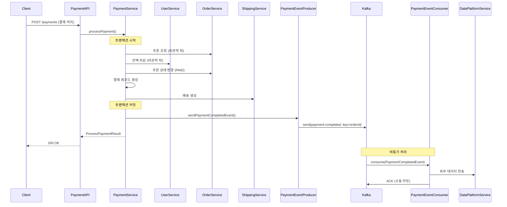
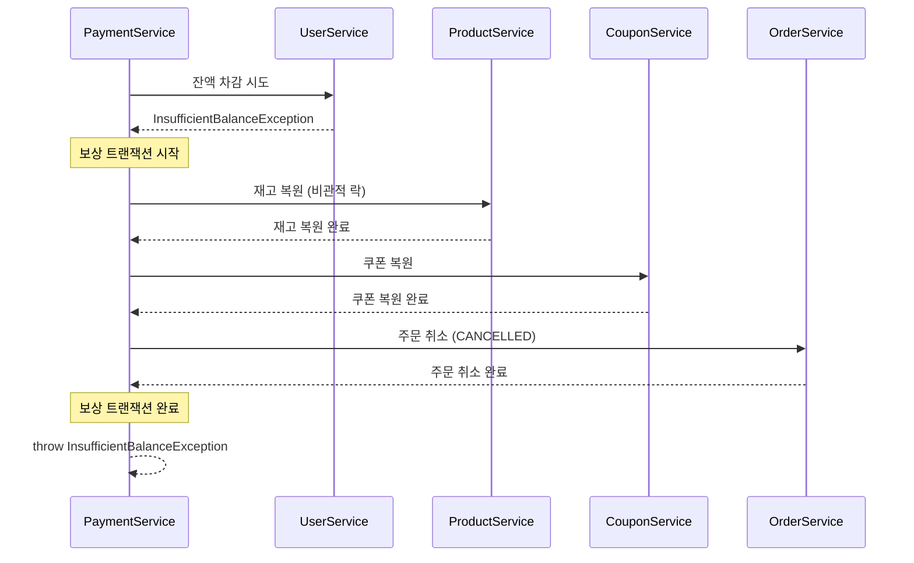
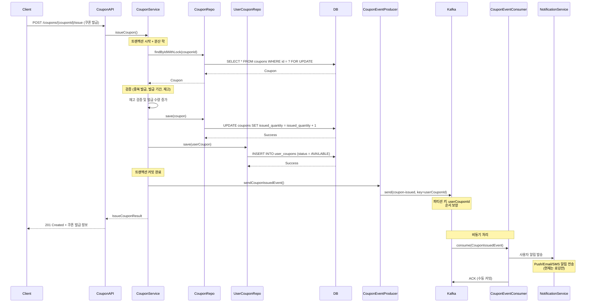

# Kafka 기반 이벤트 아키텍처 설계 문서

## 목차

1. [개요](#개요)
2. [아키텍처 개선 내용](#아키텍처-개선-내용)
3. [비즈니스 시퀀스 다이어그램](#비즈니스-시퀀스-다이어그램)
4. [Kafka 구성](#kafka-구성)
5. [설계 원칙](#설계-원칙)
6. [순서 보장 메커니즘](#순서-보장-메커니즘)
7. [장애 처리](#장애-처리)

---

## 개요

### 목적

E-commerce 시스템의 이벤트 처리를 Spring Event + @Async 기반에서 Apache Kafka 기반으로 전환하여 다음을 달성합니다:

- **확장성**: 마이크로서비스 아키텍처로의 전환 대비
- **신뢰성**: 메시지 영속성 및 재처리 보장
- **순서 보장**: 동일 주문에 대한 이벤트 순서 보장
- **비동기 처리**: 시스템 간 결합도 감소

### 변경 범위

- Order 이벤트 처리
- Payment 이벤트 처리
- Coupon 이벤트 처리 (선착순 쿠폰 발급)
- Spring Event + @Async 제거 및 Kafka Producer/Consumer로 전환

---

## 아키텍처 개선 내용

### Before (Spring Event + @Async + Redis 기반)

```
┌─────────────────┐
│ OrderService    │
└────────┬────────┘
         │ ApplicationEventPublisher.publishEvent()
         ↓
┌───────────────────────┐
│ OrderEventListener    │ (@Async + @EventListener)
│ - 비동기 스레드 풀 사용 │
└────────┬──────────────┘
         │
         ↓
┌─────────────────┐     ┌──────────────┐
│ CartService     │     │    Redis     │
│ RankingService  │ ←→  │  (캐시/랭킹)  │
└─────────────────┘     └──────────────┘
```

**문제점**:

- 서버 재시작 시 처리 중인 이벤트 손실 (메모리 내 이벤트)
- 단일 서버 내에서만 동작 (다중 서버 확장 어려움)
- 이벤트 재처리 메커니즘 부재
- @Async 스레드 풀 기반으로 부하 분산 제한

### After (Kafka 기반)

```
┌─────────────────┐
│ OrderService    │
└────────┬────────┘
         │ orderEventProducer.sendOrderCreatedEvent()
         ↓
┌───────────────────┐     ┌──────────────┐
│ OrderEventProducer │ →  │ Kafka Broker │
└───────────────────┘     └──────┬───────┘
                                 │
                                 ↓
                        ┌────────────────────┐     ┌──────────────┐
                        │ OrderEventConsumer │ ←→  │    Redis     │
                        │ - 카트 삭제         │     │  (캐시/랭킹)  │
                        │ - 랭킹 업데이트     │     └──────────────┘
                        └────────────────────┘
```

**개선점**:

- Spring Event 제거로 구조 단순화
- 메시지 영속성 보장 (Kafka 디스크 저장)
- 수평 확장 가능 (Consumer Group)
- 서버 재시작 시에도 이벤트 유실 없음
- Consumer Lag 모니터링으로 처리 지연 감지 가능

---

## 비즈니스 시퀀스 다이어그램

### 1. 주문 생성 프로세스



### 2. 결제 프로세스



### 3. 결제 실패 시 보상 트랜잭션



### 4. 선착순 쿠폰 발급 프로세스



**핵심 단계**:

1. 사용자가 쿠폰 발급 요청
2. 분산 락 + 비관적 락으로 동시성 제어
3. 중복 발급, 발급 기간, 재고 검증
4. 쿠폰 발급 수량 증가 및 사용자 쿠폰 생성
5. 트랜잭션 커밋
6. **Kafka 이벤트 발행** (CouponIssuedEvent)
7. **비동기: 사용자 알림 발송** (Consumer가 처리)

---

## Kafka 구성

### 토픽 구조

| 토픽 이름                  | 파티션 수 | 복제 계수            | 용도                        | 파티션 키      |
| -------------------------- | --------- | -------------------- | --------------------------- | -------------- |
| `order-created`            | 3         | 1 (개발: 1, 운영: 3) | 주문 생성 이벤트            | orderId        |
| `payment-completed`        | 3         | 1 (개발: 1, 운영: 3) | 결제 완료 이벤트            | orderId        |
| `coupon-issued`            | 3         | 1 (개발: 1, 운영: 3) | 쿠폰 발급 이벤트            | userCouponId   |
| `order-created.DLQ`        | 1         | 1 (개발: 1, 운영: 3) | 주문 이벤트 처리 실패 메시지 | orderId        |
| `payment-completed.DLQ`    | 1         | 1 (개발: 1, 운영: 3) | 결제 이벤트 처리 실패 메시지 | orderId        |
| `coupon-issued.DLQ`        | 1         | 1 (개발: 1, 운영: 3) | 쿠폰 이벤트 처리 실패 메시지 | userCouponId   |

### Producer 설정

```yaml
# src/main/resources/application.yml
spring:
  kafka:
    bootstrap-servers: localhost:9093
    producer:
      key-serializer: org.apache.kafka.common.serialization.StringSerializer
      value-serializer: org.springframework.kafka.support.serializer.JsonSerializer
      acks: all # 모든 레플리카 확인
      retries: 3 # 재시도 횟수
      properties:
        max.in.flight.requests.per.connection: 1 # 순서 보장
        enable.idempotence: true # 멱등성 보장
```

**주요 설정**:

- `acks: all` - 모든 레플리카가 메시지를 받았는지 확인
- `retries: 3` - 전송 실패 시 최대 3회 재시도
- `max.in.flight.requests.per.connection: 1` - 순서 보장을 위해 한 번에 하나의 요청만 처리
- `enable.idempotence: true` - Producer 레벨에서 중복 메시지 방지

### Consumer 설정

```yaml
# src/main/resources/application.yml
spring:
  kafka:
    consumer:
      group-id: hhplus-ecommerce-group
      key-deserializer: org.apache.kafka.common.serialization.StringDeserializer
      value-deserializer: org.springframework.kafka.support.serializer.JsonDeserializer
      auto-offset-reset: earliest # 최초 offset 없을 시 가장 처음부터
      enable-auto-commit: false # 수동 커밋
      properties:
        spring.json.trusted.packages: "*"
    listener:
      ack-mode: manual # 수동 ACK
```

**주요 설정**:

- `enable-auto-commit: false` - ErrorHandler가 offset 커밋을 제어
- `auto-offset-reset: earliest` - Consumer 그룹 최초 실행 시 가장 오래된 메시지부터 소비

**ErrorHandler 설정**:

```kotlin
@Bean
fun defaultErrorHandler(): DefaultErrorHandler {
    val recoverer = DeadLetterPublishingRecoverer(kafkaTemplate()) { record, _ ->
        // DLQ 토픽 이름 생성: 원본 토픽 + .DLQ
        org.apache.kafka.common.TopicPartition(record.topic() + ".DLQ", record.partition())
    }

    // FixedBackOff: 3초 간격으로 3회 재시도 (총 4회 시도)
    return DefaultErrorHandler(recoverer, FixedBackOff(3000L, 3L))
}
```

**재시도 및 DLQ 처리 흐름**:

1. Consumer에서 예외 발생
2. 3초 대기 후 1차 재시도
3. 3초 대기 후 2차 재시도
4. 3초 대기 후 3차 재시도
5. 모두 실패 시 DLQ 토픽으로 전송
6. 원본 토픽의 offset 커밋 (다음 메시지 처리)

### Producer/Consumer 코드

#### OrderEventProducer

```kotlin
@Component
@ConditionalOnProperty(
    name = ["spring.kafka.enabled"],
    havingValue = "true",
    matchIfMissing = true
)
class OrderEventProducer(
    private val kafkaTemplate: KafkaTemplate<String, Any>
) {
    companion object {
        const val TOPIC_ORDER_CREATED = "order-created"
    }

    fun sendOrderCreatedEvent(event: OrderCreatedEvent): CompletableFuture<SendResult<String, Any>> {
        val key = event.orderId.toString()  // 파티션 키

        return kafkaTemplate.send(TOPIC_ORDER_CREATED, key, event).apply {
            whenComplete { result, ex ->
                if (ex == null) {
                    logger.info("메시지 전송 성공: partition={}, offset={}",
                        result.recordMetadata.partition(),
                        result.recordMetadata.offset())
                } else {
                    logger.error("메시지 전송 실패: {}", ex.message, ex)
                }
            }
        }
    }
}
```

#### OrderEventConsumer

```kotlin
@Component
@ConditionalOnProperty(
    name = ["spring.kafka.enabled"],
    havingValue = "true",
    matchIfMissing = true
)
class OrderEventConsumer(
    private val cartService: CartService,
    private val productRankingService: ProductRankingService,
    private val objectMapper: ObjectMapper
) {
    @KafkaListener(
        topics = [OrderEventProducer.TOPIC_ORDER_CREATED],
        groupId = "\${spring.kafka.consumer.group-id}",
        containerFactory = "kafkaListenerContainerFactory"
    )
    fun consumeOrderCreatedEvent(
        @Payload message: String,
        @Header(KafkaHeaders.RECEIVED_PARTITION) partition: Int,
        @Header(KafkaHeaders.OFFSET) offset: Long
    ) {
        val event = objectMapper.readValue(message, OrderCreatedEvent::class.java)

        // 1. 상품 랭킹 업데이트 (Redis ZINCRBY)
        updateProductRanking(event)

        // 2. 카트 삭제
        deleteUserCart(event)

        // ErrorHandler가 자동으로 offset 커밋 및 예외 발생 시 재시도/DLQ 처리
    }
}
```

#### DLQConsumer

```kotlin
@Component
@ConditionalOnProperty(
    name = ["spring.kafka.enabled"],
    havingValue = "true",
    matchIfMissing = true
)
class DLQConsumer(
    private val failedMessageRepository: FailedMessageJpaRepository
) {
    @KafkaListener(
        topics = ["order-created.DLQ"],
        groupId = "\${spring.kafka.consumer.group-id}-dlq",
        containerFactory = "dlqKafkaListenerContainerFactory"
    )
    fun consumeOrderCreatedDLQ(
        record: ConsumerRecord<String, String>,
        @Header(KafkaHeaders.RECEIVED_PARTITION) partition: Int,
        @Header(KafkaHeaders.OFFSET) offset: Long,
        @Header(value = KafkaHeaders.EXCEPTION_MESSAGE, required = false) errorMessage: String?,
        @Header(value = KafkaHeaders.EXCEPTION_STACKTRACE, required = false) stackTrace: String?
    ) {
        val originalTopic = record.topic().removeSuffix(".DLQ")

        val failedMessage = FailedMessage(
            topic = originalTopic,
            partition = partition,
            offset = offset,
            messageKey = record.key(),
            payload = record.value(),
            errorMessage = errorMessage ?: "Unknown error",
            stackTrace = stackTrace,
            failedAt = LocalDateTime.now(),
            retryCount = 3,
            status = FailedMessageStatus.PENDING
        )

        failedMessageRepository.save(failedMessage)

        logger.info("DLQ Consumer - 실패 메시지 저장 완료: failedMessageId={}", failedMessage.id)
    }
}
```

---

## 설계 원칙

### 1. 재고 차감은 동기 처리, 이벤트에 포함하지 않음

**이유**:

- 재고 차감은 주문 생성 시점에 즉시 처리해야 재고 초과 판매 방지
- Kafka 이벤트는 비동기이므로 재고 정합성 보장 불가
- 동시 주문 시 경쟁 조건(Race Condition) 발생 가능

**구현**:

```kotlin
@Transactional
fun createOrder(request: CreateOrderCommand): CreateOrderResult {
    // 1. 동기: 재고 차감 (비관적 락)
    val products = deductStock(request.items)

    // 2. 동기: 주문 저장
    val order = saveOrder(...)

    // 트랜잭션 커밋 후

    // 3. 비동기: Kafka 이벤트 발행 (랭킹, 카트 삭제)
    orderEventProducer?.sendOrderCreatedEvent(...)
}
```

### 2. 이벤트는 필요한 최소 정보만 포함

**OrderCreatedEvent**:

```kotlin
data class OrderCreatedEvent(
    val orderId: UUID,
    val userId: UUID,
    val productIds: List<UUID>,
    val items: List<OrderItemInfo>  // productId, quantity만
)
```

**포함하지 않는 정보**:

- ❌ 재고 정보 (이미 차감 완료)
- ❌ 가격 정보 (Consumer가 필요 시 조회)
- ❌ 전체 Order 엔티티 (불필요한 데이터 전송 방지)

### 3. Kafka 발행 실패는 주 비즈니스에 영향을 주지 않음

**구현**:

```kotlin
// Kafka 발행 실패 시 로그만 기록, 주문 생성은 성공
orderEventProducer?.let {
    try {
        it.sendOrderCreatedEvent(event)
    } catch (e: Exception) {
        logger.error("Kafka 발행 실패 - orderId: ${order.id}", e)
        // 예외를 던지지 않음
    }
}
```

**이유**:

- 주문 생성은 이미 트랜잭션 커밋 완료
- Kafka 장애로 인한 주문 실패 방지
- Consumer는 나중에 재처리 가능

### 4. Producer는 Optional로 주입 (테스트 환경 대응)

**구현**:

```kotlin
@Service
class OrderServiceImpl(
    private val orderEventProducer: OrderEventProducer? = null
) : OrderService {
    // Null-safe 호출
    orderEventProducer?.let {
        it.sendOrderCreatedEvent(event)
    }
}
```

**이유**:

- 테스트 환경에서 Kafka 불필요
- `spring.kafka.enabled=false`로 Producer Bean 생성 제외 가능

---

## 순서 보장 메커니즘

### 1. 파티션 키 사용

**동작 원리**:

```
orderId를 파티션 키로 사용
→ 동일 orderId는 항상 같은 파티션으로 전송
→ 파티션 내에서 순서 보장
```

**예시**:

```
Order A (orderId=1) → Partition 0
Order B (orderId=2) → Partition 1
Order A 결제 (orderId=1) → Partition 0  (같은 파티션!)
Order C (orderId=3) → Partition 2
Order B 결제 (orderId=2) → Partition 1  (같은 파티션!)
```

### 2. Producer 설정

```kotlin
ProducerConfig.MAX_IN_FLIGHT_REQUESTS_PER_CONNECTION to 1
```

**의미**:

- 한 번에 하나의 요청만 전송
- 네트워크 장애 시 재전송 순서 보장

**순서 보장 흐름**:

```
메시지 1 전송 → 응답 대기 → 응답 수신 → 메시지 2 전송
```

### 3. 멱등성 보장

```kotlin
ProducerConfig.ENABLE_IDEMPOTENCE_CONFIG to true
```

**효과**:

- Producer가 메시지 ID를 자동 할당
- Broker가 중복 메시지 자동 제거
- 네트워크 오류로 인한 재전송 시 중복 방지

**동작**:

```
Producer: 메시지 전송 (ID=1)
→ 네트워크 오류
→ Producer: 재전송 (ID=1, 동일)
→ Broker: 이미 처리된 메시지 (ID=1) → 무시
```

### 4. Consumer 설정

```kotlin
ConsumerConfig.MAX_POLL_RECORDS_CONFIG to 1  // 한 번에 1개씩 처리
```

**효과**:

- 파티션 내에서 순차적으로 처리
- 처리 실패 시 다음 메시지로 넘어가지 않음

---

## 장애 처리

### 1. Kafka Producer 장애

**시나리오**: Kafka 브로커 다운

**처리**:

```kotlin
try {
    orderEventProducer?.sendOrderCreatedEvent(event)
} catch (e: Exception) {
    logger.error("Kafka 발행 실패", e)
    // 주문 생성은 이미 성공 (트랜잭션 커밋 완료)
    // 나중에 수동 재발행 또는 배치로 처리
}
```

**복구**:

- Kafka 복구 후 누락된 이벤트 수동 재발행
- 또는 주문 테이블을 스캔하여 누락된 이벤트 찾아 재발행

### 2. Kafka Consumer 장애 및 DLQ 처리

**시나리오**: Consumer 처리 중 예외 발생

**처리 흐름**:

```
1. 메시지 처리 시도 → 실패
   ↓
2. 3초 대기 → 재시도 1회 → 실패
   ↓
3. 3초 대기 → 재시도 2회 → 실패
   ↓
4. 3초 대기 → 재시도 3회 → 실패
   ↓
5. DLQ 토픽으로 전송 (예: order-created.DLQ)
   ↓
6. 원본 토픽 offset 커밋 → 다음 메시지 처리
   ↓
7. DLQ Consumer가 실패 메시지를 DB에 저장
   ↓
8. 관리자가 수동으로 확인 및 재처리
```

**DLQ 데이터베이스 스키마**:

```sql
CREATE TABLE failed_messages (
    id BINARY(16) PRIMARY KEY,
    topic VARCHAR(255) NOT NULL,           -- 원본 토픽 (order-created)
    partition INT NOT NULL,
    offset BIGINT NOT NULL,
    message_key VARCHAR(255),
    payload TEXT NOT NULL,                  -- JSON 메시지
    error_message TEXT NOT NULL,
    stack_trace TEXT,
    failed_at TIMESTAMP NOT NULL,
    retry_count INT NOT NULL,               -- 재시도 횟수 (3)
    status VARCHAR(20) NOT NULL,            -- PENDING, REPROCESSED, IGNORED
    reprocessed_at TIMESTAMP,
    reprocess_note TEXT,
    created_at TIMESTAMP NOT NULL,
    updated_at TIMESTAMP NOT NULL,
    INDEX idx_topic_status (topic, status),
    INDEX idx_failed_at (failed_at)
);
```

**수동 재처리 프로세스**:

1. **실패 메시지 조회**
   ```kotlin
   val failedMessages = failedMessageRepository
       .findByTopicAndStatus("order-created", FailedMessageStatus.PENDING)
   ```

2. **실패 원인 분석**
   - `error_message`: 에러 메시지 확인
   - `stack_trace`: 스택 트레이스 분석
   - `payload`: 원본 메시지 내용 확인

3. **재처리 또는 무시**
   ```kotlin
   // 재처리
   failedMessage.markAsReprocessed("문제 해결 후 재처리 완료")

   // 무시
   failedMessage.markAsIgnored("데이터 오류로 재처리 불필요")
   ```

**복구**:

- 일시적 오류 (DB 연결 오류, 네트워크 타임아웃 등): 재시도로 자동 복구
- 영구적 오류 (데이터 오류, 비즈니스 규칙 위반 등): DLQ에 저장 후 수동 처리

### 3. 메시지 처리 실패 (비치명적)

**시나리오**: 랭킹 업데이트 실패

**처리**:

```kotlin
private fun updateProductRanking(event: OrderCreatedEvent) {
    try {
        productRankingService.incrementOrderCount(...)
    } catch (e: Exception) {
        logger.error("랭킹 업데이트 실패", e)
        // 예외를 던지지 않음 → 재시도 없이 ACK 진행
        // 랭킹 실패가 주 비즈니스에 영향을 주지 않도록
    }
}
```

**이유**:

- 랭킹 업데이트는 부가 기능
- 실패해도 주문/결제에 영향 없음
- 예외를 던지지 않으면 DLQ로 가지 않음

### 4. 보상 트랜잭션 (결제 실패 시)

**시나리오**: 잔액 부족으로 결제 실패

**처리**:

```kotlin
try {
    user.deduct(paymentAmount)
} catch (e: InsufficientBalanceException) {
    // 보상 트랜잭션
    handlePaymentFailure(order)  // 재고 복원, 쿠폰 복원, 주문 취소
    throw e
}
```

**보상 순서**:

1. 재고 복원 (Product.restoreStock())
2. 쿠폰 복원 (UserCoupon.restore())
3. 주문 취소 (Order.cancel())

---

## 모니터링

### 주요 지표

1. **Producer**

   - 전송 성공률
   - 전송 지연 시간
   - 재시도 횟수

2. **Consumer**

   - 처리량 (messages/sec)
   - Consumer Lag (미처리 메시지 수)
   - 처리 실패율

3. **Kafka Broker**
   - 디스크 사용량
   - 파티션별 메시지 수
   - 복제 지연

### 로그 패턴

```kotlin
// Producer
logger.info("Kafka Producer - 메시지 전송 성공: topic={}, partition={}, offset={}", ...)
logger.error("Kafka Producer - 메시지 전송 실패: topic={}, key={}, error={}", ...)

// Consumer
logger.info("Kafka Consumer - 메시지 수신: topic={}, partition={}, offset={}", ...)
logger.info("Kafka Consumer - 메시지 처리 완료 및 ACK: orderId={}, partition={}, offset={}", ...)
logger.error("Kafka Consumer - 메시지 처리 실패: partition={}, offset={}, error={}", ...)
```

---

## 확장 계획

### 1. 마이크로서비스 전환

현재 구조는 마이크로서비스로 쉽게 전환 가능:

```
┌─────────────┐     ┌──────────────┐     ┌─────────────┐
│ Order       │ →   │ Kafka        │ →   │ Ranking     │
│ Service     │     │ Cluster      │     │ Service     │
└─────────────┘     └──────────────┘     └─────────────┘
```

### 2. 이벤트 추가

새로운 이벤트 추가 용이:

- `order-cancelled` - 주문 취소
- `payment-failed` - 결제 실패
- `shipping-started` - 배송 시작

### 3. Dead Letter Queue (DLQ) ✅ 구현 완료

**현재 상태**: 완전히 구현됨

**DLQ 구조**:

```
원본 토픽: order-created
DLQ 토픽: order-created.DLQ

원본 토픽: payment-completed
DLQ 토픽: payment-completed.DLQ

원본 토픽: coupon-issued
DLQ 토픽: coupon-issued.DLQ
```

**구현 내용**:

1. **DefaultErrorHandler**: 재시도 3회 후 DLQ 전송
2. **DLQConsumer**: DLQ 메시지를 DB에 저장
3. **FailedMessage 엔티티**: 실패 메시지 영구 보관
4. **수동 재처리 지원**: 관리자가 DB에서 확인 후 재처리 가능

**관리자 대시보드 (향후 개발)**:

- 실패 메시지 목록 조회
- 실패 원인 분석
- 원클릭 재처리 기능
- 통계 및 모니터링

---

## 결론

### 달성한 목표

1. ✅ **일관성**: Order, Payment, Coupon 모두 동일한 Kafka 패턴 적용
2. ✅ **순서 보장**: orderId/userCouponId 파티션 키 사용
3. ✅ **멱등성**: Producer 레벨 중복 방지
4. ✅ **확장성**: 마이크로서비스 전환 대비
5. ✅ **신뢰성**: 메시지 영속성 및 재처리 보장
6. ✅ **DLQ 구현**: 재시도 실패 메시지 자동 저장 및 수동 처리 지원
7. ✅ **선착순 쿠폰 발급**: Kafka 기반 비동기 알림 처리

### 향후 개선 사항

1. **관리자 대시보드**: DLQ 메시지 조회 및 재처리 UI
2. **메트릭 수집**: Prometheus + Grafana로 Consumer Lag 모니터링
3. **Circuit Breaker**: Resilience4j 적용
4. **이벤트 버전 관리**: Schema Registry 도입
5. **알림 시스템**: DLQ에 메시지가 쌓이면 Slack/Email 알림
