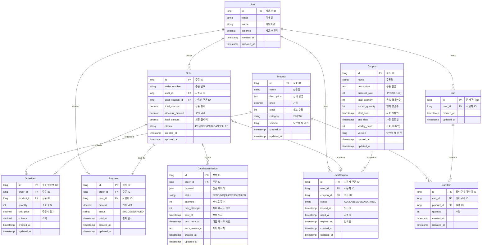

# 데이터베이스 다이어그램

이 문서는 이커머스 시스템의 데이터베이스 구조를 다이어그램으로 표현합니다.

## 1. Entity Relationship Diagram (ERD)

### 1.1 전체 ERD



---

## 2. 도메인별 상세 다이어그램

### 2.1 상품 관리 도메인


**핵심 기능**:
- 상품 정보 조회 (가격, 재고)
- 재고 실시간 확인
- 인기 상품 통계 (최근 3일, Top 5)

**동시성 제어**:
- `version`: 재고 차감 시 낙관적 락 사용
- `stock >= 0` 제약 조건으로 음수 재고 방지

**인덱스**:
- `idx_category`: (category) - 카테고리별 조회 최적화
- `idx_created_at`: (created_at) - 신상품 조회 최적화

---

### 2.2 장바구니 도메인


**핵심 기능**:
- 장바구니에 상품 추가
- 수량 변경
- 상품 삭제
- 장바구니 조회 (재고 확인 포함)

**비즈니스 규칙**:
- 1인 1개의 장바구니
- 동일 상품 추가 시 수량 합산
- 최대 수량 제한: 100개/상품
- 주문 완료 시 장바구니 자동 비우기

**인덱스**:
- `idx_user_id`: (user_id) - 사용자별 장바구니 조회
- `idx_cart_product`: (cart_id, product_id) - 중복 상품 체크

---

### 2.3 주문/결제 도메인


**핵심 기능**:
- 주문 생성 (장바구니 기반)
- 재고 확인 및 차감
- 잔액 기반 결제
- 쿠폰 할인 적용

**인덱스**:
- `idx_user_status`: (user_id, status) - 사용자별 주문 조회 최적화
- `idx_created_at`: (created_at) - 최신 주문 조회 최적화
- `idx_order_id`: (order_id) - 주문 아이템 조회 최적화

---

### 2.3 쿠폰 시스템 도메인


**핵심 기능**:
- 선착순 발급 (한정 수량)
- 쿠폰 유효성 검증
- 사용 이력 관리

**동시성 제어**:
- `version`: 낙관적 락으로 동시 발급 제어
- `issued_quantity < total_quantity`: 선착순 보장

**인덱스**:
- `idx_user_status`: (user_id, status) - 사용자별 쿠폰 조회
- `idx_coupon_id`: (coupon_id) - 쿠폰별 발급 현황 조회
- `idx_expires_at`: (expires_at) - 만료 쿠폰 배치 처리

---

### 2.4 데이터 연동 도메인 (Outbox Pattern)


**핵심 기능**:
- 주문 데이터 외부 전송
- 실패 시에도 주문은 정상 처리
- 재시도 메커니즘 (최대 3회)

**인덱스**:
- `idx_status_created`: (status, created_at) - 재시도 대상 조회
- `idx_order_id`: (order_id) - 주문별 전송 이력 조회

---

## 3. 데이터 흐름 다이어그램

### 3.1 주문 프로세스 데이터 흐름


---

## 4. 테이블 관계 요약

### 4.1 1:N 관계
| 부모 테이블 | 자식 테이블 | 관계 설명 |
|------------|------------|----------|
| User | Order | 한 사용자는 여러 주문을 생성 |
| User | UserCoupon | 한 사용자는 여러 쿠폰을 보유 |
| User | Payment | 한 사용자는 여러 결제를 실행 |
| Cart | CartItem | 한 장바구니는 여러 상품 아이템 포함 |
| Order | OrderItem | 한 주문은 여러 상품 아이템 포함 |
| Order | DataTransmission | 한 주문은 여러 전송 이력 보유 (재시도) |
| Product | OrderItem | 한 상품은 여러 주문에 포함 |
| Product | CartItem | 한 상품은 여러 장바구니에 추가 |
| Coupon | UserCoupon | 한 쿠폰은 여러 사용자에게 발급 |

### 4.2 1:1 관계
| 테이블 1 | 테이블 2 | 관계 설명 |
|---------|---------|----------|
| User | Cart | 한 사용자는 하나의 장바구니만 소유 |
| Order | Payment | 한 주문은 하나의 결제만 연결 (선택적) |

### 4.3 선택적 관계 (Optional)
| 테이블 | 관계 | 설명 |
|--------|------|------|
| Order | UserCoupon | 주문 시 쿠폰 사용은 선택사항 |
| Order | Payment | PAID 상태일 때만 Payment 레코드 생성 |
| Order | DataTransmission | PAID 상태일 때만 전송 레코드 생성 |

### 4.4 주요 제약 조건
| 테이블 | 컬럼 | 제약 조건 | 설명 |
|--------|------|----------|------|
| Product | stock, version | CHECK(stock >= 0), version 낙관적 락 | 재고는 음수 불가, 동시성 제어 |
| Coupon | issued_quantity, version | issued_quantity <= total_quantity, version 낙관적 락 | 발급 수량 제한, 동시성 제어 |
| UserCoupon | user_id, coupon_id | UNIQUE(user_id, coupon_id) | 1인 1매 제한 |
| CartItem | cart_id, product_id | UNIQUE(cart_id, product_id) | 장바구니 내 중복 상품 방지 |
| Order | order_number | UNIQUE | 주문 번호 고유성 |
| DataTransmission | attempts | attempts <= max_attempts | 최대 재시도 횟수 제한 |

---

## 5. 제약 조건 및 비즈니스 규칙

### 5.1 재고 관리
```sql
-- 재고 차감 시 항상 재고 >= 차감량 검증
CHECK (stock >= 0)

-- 주문 생성 시 재고 차감
UPDATE products
SET stock = stock - :quantity
WHERE id = :productId
  AND stock >= :quantity
```

### 5.2 쿠폰 발급
```sql
-- 선착순 발급 (낙관적 락)
UPDATE coupons
SET issued_quantity = issued_quantity + 1,
    version = version + 1
WHERE id = :couponId
  AND issued_quantity < total_quantity
  AND version = :currentVersion

-- 중복 발급 방지
UNIQUE KEY uk_user_coupon (user_id, coupon_id)
```

### 5.3 금액 계산
```kotlin
// 주문 금액 계산
totalAmount = Σ(OrderItem.subtotal)
discountAmount = totalAmount × (coupon.discountRate ÷ 100) [내림]
finalAmount = totalAmount - discountAmount

// 잔액 검증
User.balance >= Order.finalAmount
```

### 5.4 상태 전이
```
Order: PENDING → PAID or CANCELLED
UserCoupon: AVAILABLE → USED → (AVAILABLE or EXPIRED)
DataTransmission: PENDING → SUCCESS or FAILED
```

---

## 6. 성능 최적화 전략

### 6.1 인덱스 전략
| 테이블 | 인덱스 | 목적 |
|--------|--------|------|
| products | idx_category | 카테고리 필터링 |
| products | idx_created_at | 신상품 조회 |
| orders | idx_user_status | 사용자별 주문 조회 |
| orders | idx_created_at | 최신 주문 조회 |
| order_items | idx_order_id | 주문 상세 조회 |
| order_items | idx_product_id | 인기 상품 통계 |
| user_coupons | idx_user_status | 사용 가능 쿠폰 조회 |
| user_coupons | idx_expires_at | 만료 쿠폰 배치 |
| data_transmissions | idx_status_created | 재시도 대상 조회 |

### 6.2 동시성 제어
- **재고 차감**: 낙관적 락 (향후 적용)
- **쿠폰 발급**: 낙관적 락 (version 필드)
- **주문 생성**: 트랜잭션 격리 수준 (READ_COMMITTED)

### 6.3 쿼리 최적화
```sql
-- 인기 상품 조회 (최근 3일, Top 5)
SELECT
    p.id, p.name,
    SUM(oi.quantity) as sales_count,
    SUM(oi.subtotal) as revenue
FROM order_items oi
JOIN products p ON oi.product_id = p.id
JOIN orders o ON oi.order_id = o.id
WHERE o.created_at >= DATE_SUB(NOW(), INTERVAL 3 DAY)
  AND o.status = 'PAID'
GROUP BY p.id, p.name
ORDER BY sales_count DESC
LIMIT 5;
```

---

## 참고 문서
- [요구사항 분석](./requirements-analysis.md)
- [시퀀스 다이어그램](./sequence-diagrams.md)
- [데이터베이스 스키마 상세](./DATABASE_SCHEMA.md)