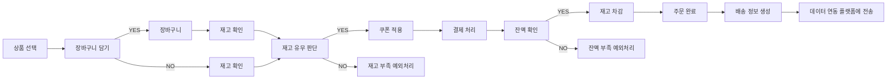

## Step 1: 요구사항 분석
### 이커머스 핵심 기능
1. 상품 관리
    - 상품 정보 조회 (가격, 재고)
    - 재고 실시간 확인
    - 인기 상품 통계 (최근 3일, Top 5)

2. 주문/결제 시스템
    - 장바구니 기능
    - 재고 확인 및 차감
    - 잔액 기반 결제
    - 쿠폰 할인 적용

3. 쿠폰 시스템
    - 선착순 발급 (한정 수량)
    - 쿠폰 유효성 검증
    - 사용 이력 관리

4. 배송 관리
    - 주문 완료 시 배송 정보 자동 생성
    - 배송 상태 추적 (PENDING → IN_TRANSIT → DELIVERED)
    - 택배사 및 송장번호 관리
    - 배송 시작일/도착 예정일/실제 도착일 기록

5. 데이터 연동
    - 주문 데이터 외부 전송
    - 실패 시에도 주문은 정상 처리
    - 재시도 메커니즘 (최대 3회)

### 1.2 주문 프로세스 Flow
