# 시퀀스 다이어그램

이 문서는 이커머스 시스템의 주요 기능별 시퀀스 다이어그램을 정의합니다.

## 목차
1. [상품 관리](#1-상품-관리)
2. [주문/결제 시스템](#2-주문결제-시스템)
3. [쿠폰 시스템](#3-쿠폰-시스템)
4. [데이터 연동](#4-데이터-연동)

---

## 1. 상품 관리

### 1.1 상품 목록 조회

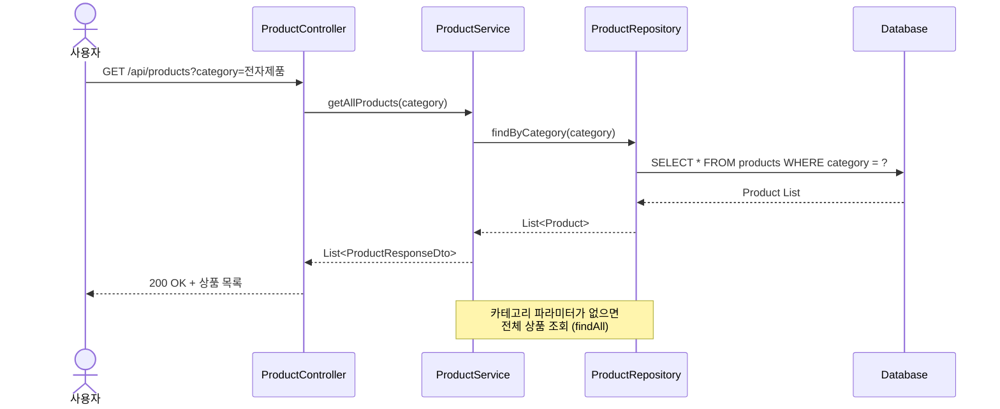

**핵심 로직**:
- 카테고리 필터링 (선택사항)
- 재고 0인 상품도 표시 (품절 표시)

---

### 1.2 상품 재고 확인

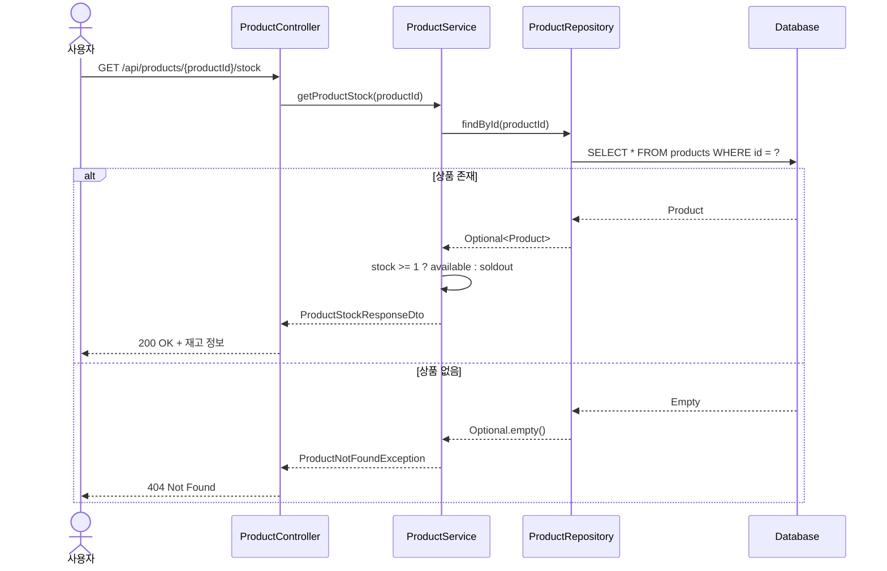

**핵심 로직**:
- 실시간 재고 조회
- 재고 상태 판단 (available/soldout)

---

### 1.3 인기 상품 조회 (최근 3일, Top 5)

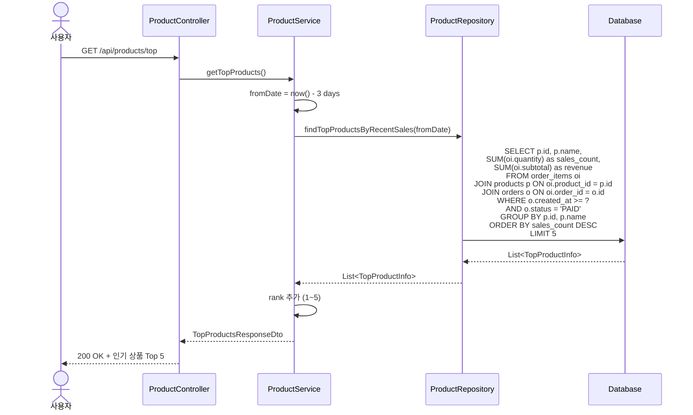

**핵심 로직**:
- 최근 3일 데이터만 집계
- PAID 상태 주문만 포함
- 판매량 기준 정렬
- Top 5 제한

---

## 2. 주문/결제 시스템

### 2.1 주문 생성 (정상 흐름)

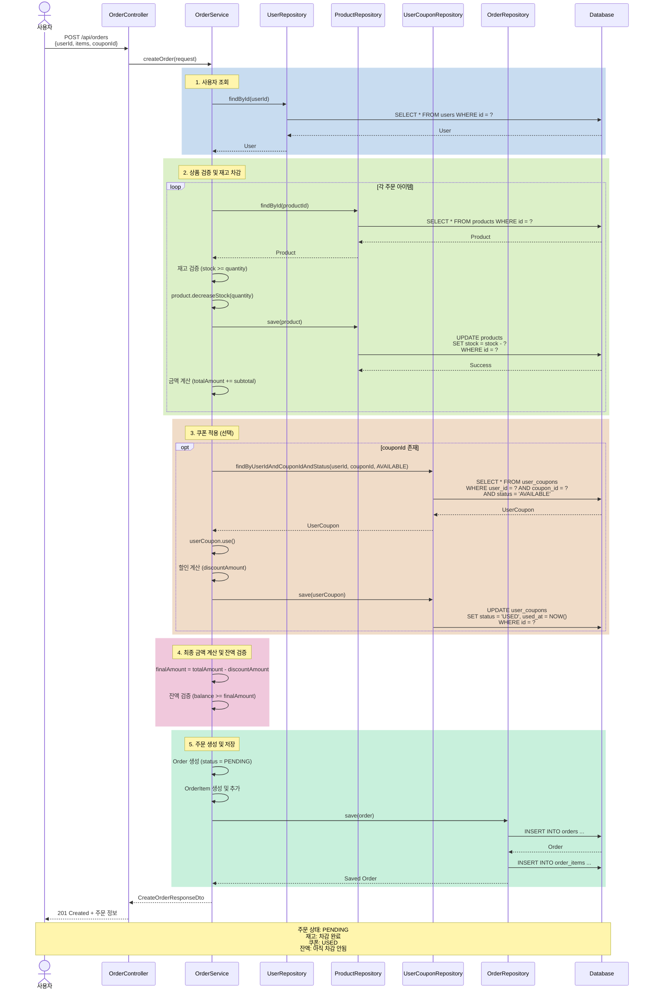

**핵심 단계**:
1. 사용자 조회
2. 상품 검증 및 재고 차감 (즉시)
3. 쿠폰 적용 및 사용 처리
4. 최종 금액 계산 및 잔액 검증
5. 주문 생성 (PENDING 상태)

---

### 2.2 주문 생성 (재고 부족 예외)

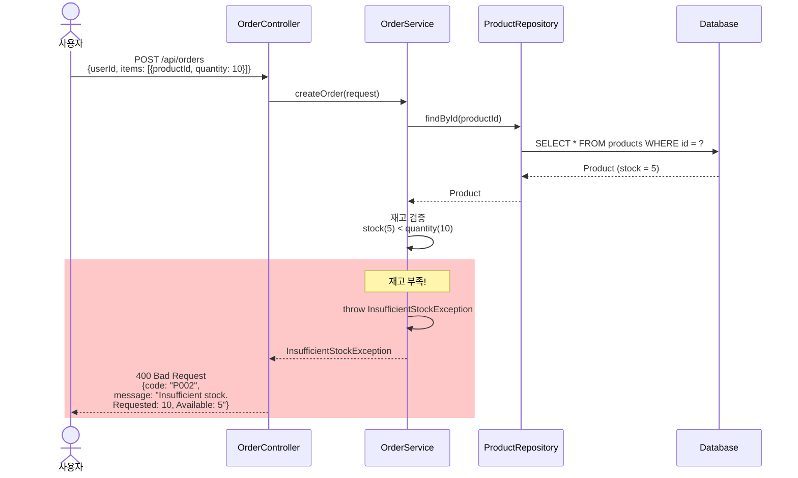

**에러 처리**:
- 재고 부족 시 주문 생성 거부
- 명확한 에러 메시지 (요청 수량 vs 가능 수량)

---

### 2.3 주문 생성 (잔액 부족 예외)

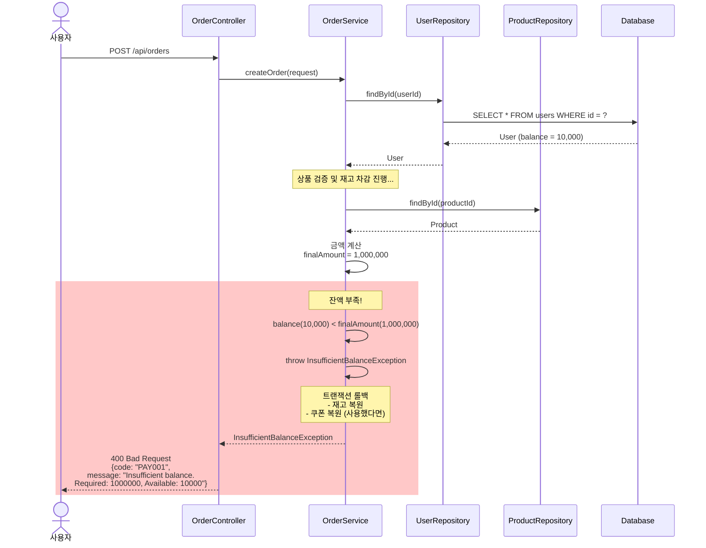

**에러 처리**:
- 잔액 부족 시 트랜잭션 롤백
- 재고 및 쿠폰 자동 복원

---

### 2.4 결제 처리 (진행 중)

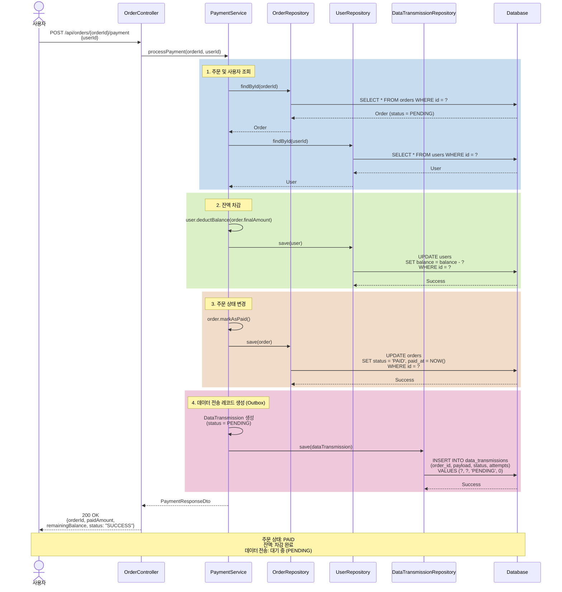

**핵심 단계**:
1. 주문 및 사용자 조회
2. 잔액 차감
3. 주문 상태 변경 (PENDING → PAID)
4. 데이터 전송 레코드 생성 (Outbox Pattern)

---

### 2.5 주문 조회

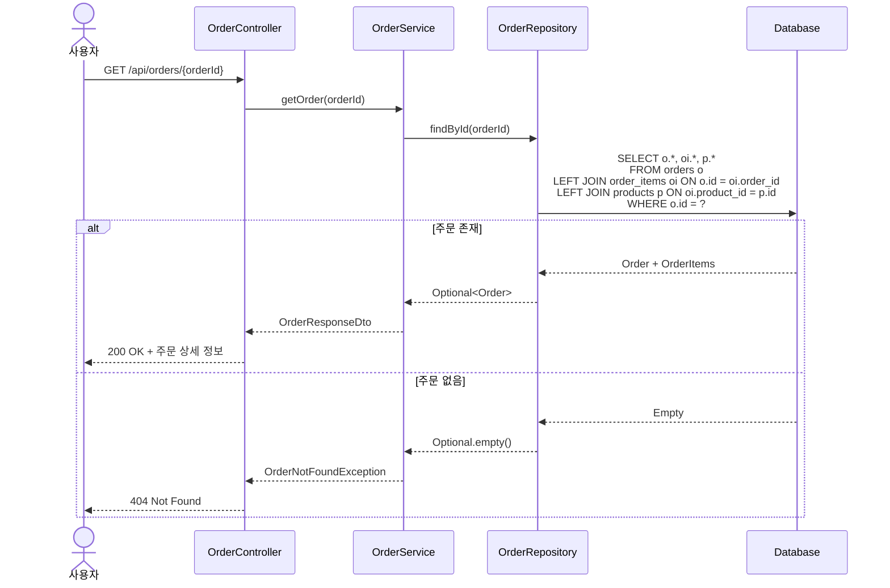

---

### 2.6 사용자별 주문 목록 조회

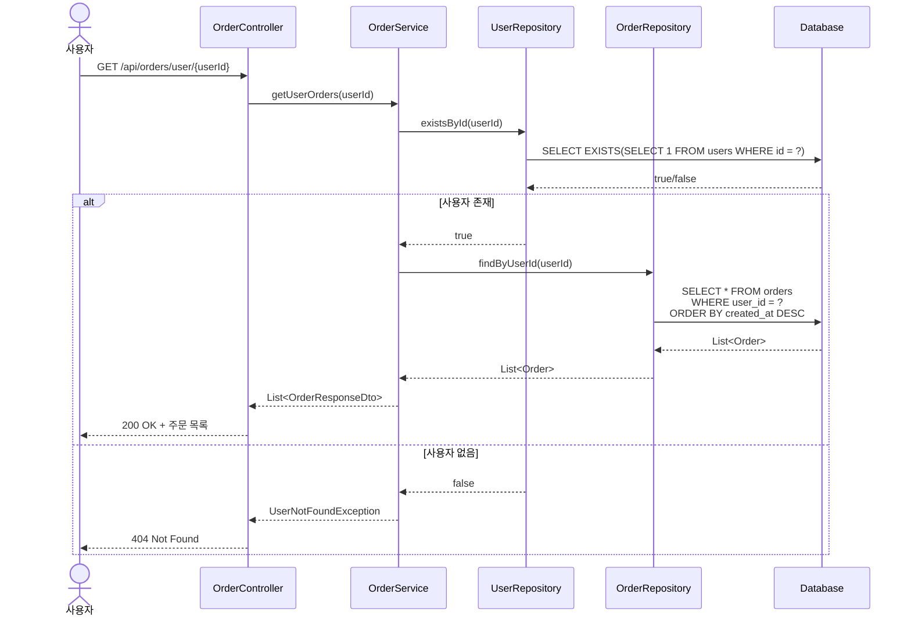

---

## 3. 쿠폰 시스템

### 3.1 쿠폰 발급 (선착순)

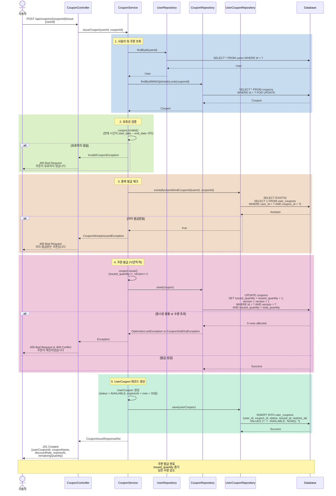

**핵심 로직**:
- 낙관적 락으로 동시성 제어 (`version` 필드)
- `issued_quantity < total_quantity` 조건 체크
- 중복 발급 방지 (`user_id`, `coupon_id` 조합)
- 발급 후 30일 자동 만료

---

### 3.2 보유 쿠폰 조회

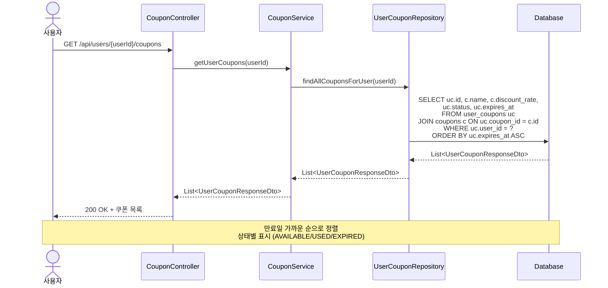

---

### 3.3 쿠폰 목록 조회

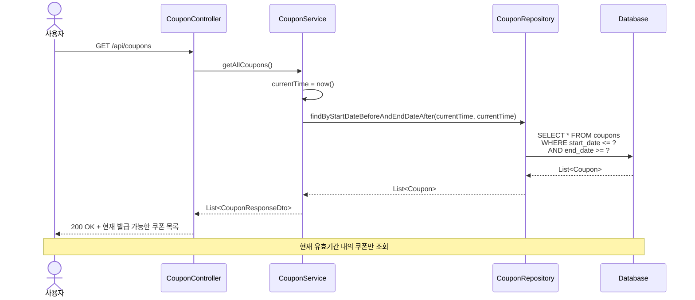

---

## 4. 데이터 연동

### 4.1 데이터 전송 (Outbox Pattern)

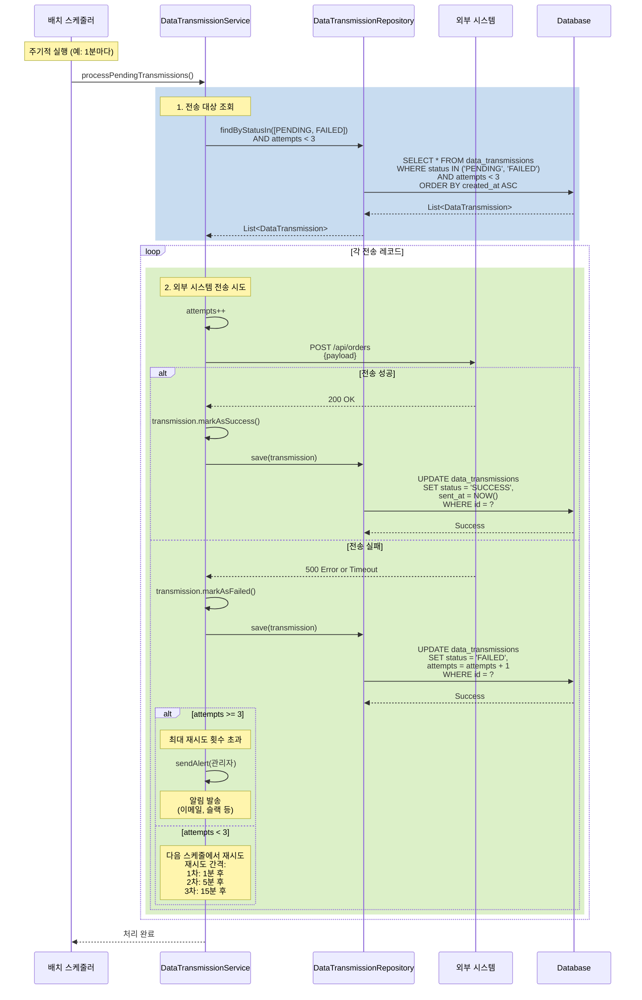

**핵심 로직**:
- Outbox Pattern으로 트랜잭션과 분리
- 최대 3회 재시도
- 지수 백오프 (1분, 5분, 15분)
- 실패 시 알림 발송

---

### 4.2 데이터 전송 재시도 로직

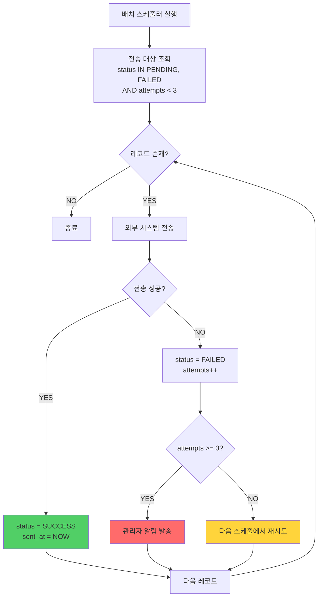

**재시도 간격**:
| 시도 | 실패 후 대기 시간 | 설명 |
|------|------------------|------|
| 1차 | 1분 | 일시적 장애 대응 |
| 2차 | 5분 | 시스템 복구 대기 |
| 3차 | 15분 | 최종 재시도 |
| 실패 | - | 관리자 개입 필요 |

---

## 5. 주요 예외 처리 시나리오

### 5.1 동시성 충돌 (쿠폰 발급)

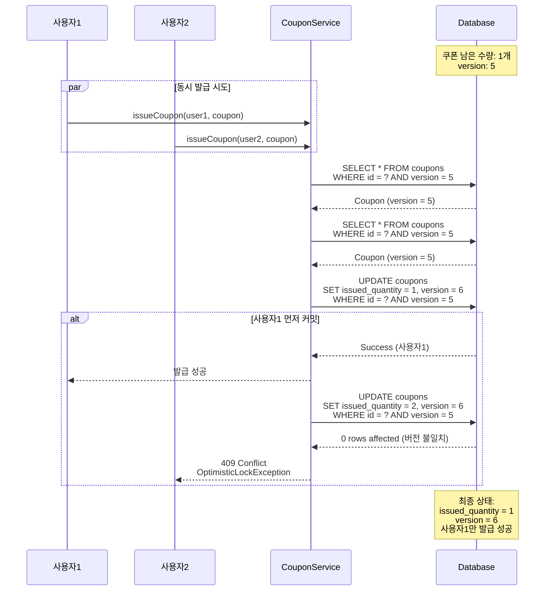

---

## 참고 문서
- [요구사항 분석](./requirements-analysis.md)
- [데이터베이스 다이어그램](./database-diagram.md)
- [API 명세서](./api/api-specification.md)