# 시퀀스 다이어그램

이 문서는 이커머스 시스템의 주요 기능별 시퀀스 다이어그램을 정의합니다.

---

## 1. 상품 관리

### 1.1 상품 목록 조회

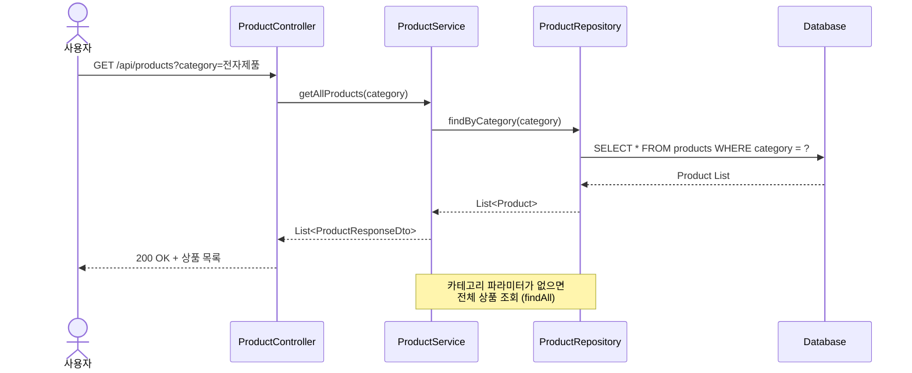
```mermaid
sequenceDiagram
    actor User as 사용자
    participant Controller as ProductController
    participant Service as ProductService
    participant Repository as ProductRepository
    participant DB as Database

    User->>Controller: GET /api/products?category=전자제품
    Controller->>Service: getAllProducts(category)
    Service->>Repository: findByCategory(category)
    Repository->>DB: SELECT * FROM products WHERE category = ?
    DB-->>Repository: Product List
    Repository-->>Service: List<Product>
    Service-->>Controller: List<ProductResponseDto>
    Controller-->>User: 200 OK + 상품 목록

    Note over Service,Repository: 카테고리 파라미터가 없으면<br/>전체 상품 조회 (findAll)
```

**핵심 로직**:
- 카테고리 필터링 (선택사항)
- 재고 0인 상품도 표시 (품절 표시)

---

### 1.2 상품 재고 확인

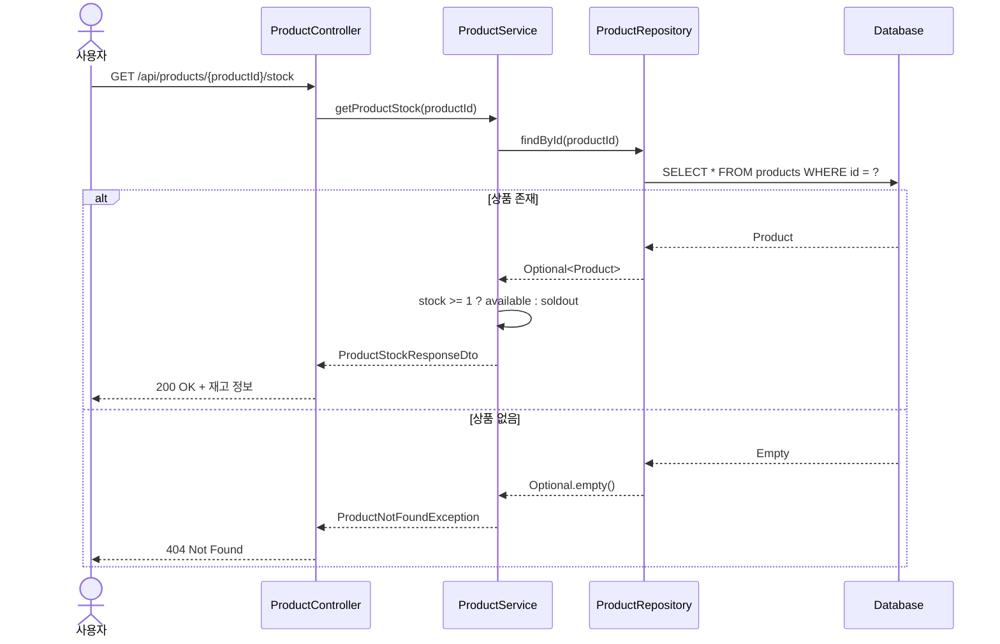
```mermaid
sequenceDiagram
    actor User as 사용자
    participant Controller as ProductController
    participant Service as ProductService
    participant Repository as ProductRepository
    participant DB as Database

    User->>Controller: GET /api/products/{productId}/stock
    Controller->>Service: getProductStock(productId)
    Service->>Repository: findById(productId)
    Repository->>DB: SELECT * FROM products WHERE id = ?

    alt 상품 존재
        DB-->>Repository: Product
        Repository-->>Service: Optional<Product>
        Service->>Service: stock >= 1 ? available : soldout
        Service-->>Controller: ProductStockResponseDto
        Controller-->>User: 200 OK + 재고 정보
    else 상품 없음
        DB-->>Repository: Empty
        Repository-->>Service: Optional.empty()
        Service-->>Controller: ProductNotFoundException
        Controller-->>User: 404 Not Found
    end
```

**핵심 로직**:
- 실시간 재고 조회
- 재고 상태 판단 (available/soldout)

---

### 1.3 인기 상품 조회 (최근 3일, Top 5)

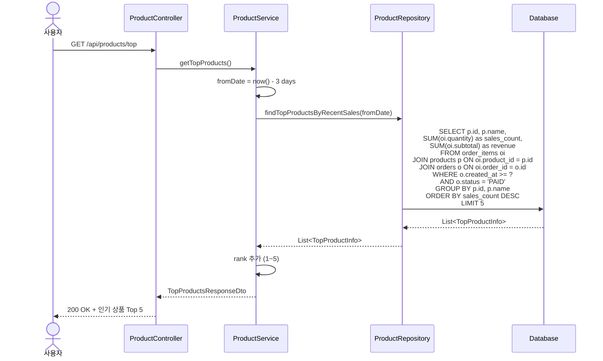
```mermaid
sequenceDiagram
    actor User as 사용자
    participant Controller as ProductController
    participant Service as ProductService
    participant Repository as ProductRepository
    participant DB as Database

    User->>Controller: GET /api/products/top
    Controller->>Service: getTopProducts()
    Service->>Service: fromDate = now() - 3 days
    Service->>Repository: findTopProductsByRecentSales(fromDate)

    Repository->>DB: SELECT p.id, p.name,<br/>SUM(oi.quantity) as sales_count,<br/>SUM(oi.subtotal) as revenue<br/>FROM order_items oi<br/>JOIN products p ON oi.product_id = p.id<br/>JOIN orders o ON oi.order_id = o.id<br/>WHERE o.created_at >= ?<br/>AND o.status = 'PAID'<br/>GROUP BY p.id, p.name<br/>ORDER BY sales_count DESC<br/>LIMIT 5

    DB-->>Repository: List<TopProductInfo>
    Repository-->>Service: List<TopProductInfo>
    Service->>Service: rank 추가 (1~5)
    Service-->>Controller: TopProductsResponseDto
    Controller-->>User: 200 OK + 인기 상품 Top 5
```

**핵심 로직**:
- 최근 3일 데이터만 집계
- PAID 상태 주문만 포함
- 판매량 기준 정렬
- Top 5 제한

---

## 2. 사용자 관리

### 2.1 잔액 충전

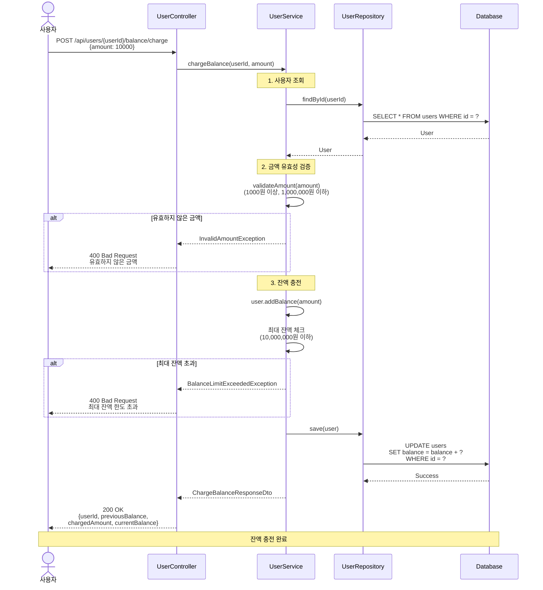
```mermaid
sequenceDiagram
    actor User as 사용자
    participant Controller as UserController
    participant Service as UserService
    participant Repository as UserRepository
    participant DB as Database

    User->>Controller: POST /api/users/{userId}/balance/charge<br/>{amount: 10000}
    Controller->>Service: chargeBalance(userId, amount)

    Note over Service: 1. 사용자 조회
    Service->>Repository: findById(userId)
    Repository->>DB: SELECT * FROM users WHERE id = ?
    DB-->>Repository: User
    Repository-->>Service: User

    Note over Service: 2. 금액 유효성 검증
    Service->>Service: validateAmount(amount)<br/>(1000원 이상, 1,000,000원 이하)

    alt 유효하지 않은 금액
        Service-->>Controller: InvalidAmountException
        Controller-->>User: 400 Bad Request<br/>유효하지 않은 금액
    end

    Note over Service: 3. 잔액 충전
    Service->>Service: user.addBalance(amount)
    Service->>Service: 최대 잔액 체크<br/>(10,000,000원 이하)

    alt 최대 잔액 초과
        Service-->>Controller: BalanceLimitExceededException
        Controller-->>User: 400 Bad Request<br/>최대 잔액 한도 초과
    end

    Service->>Repository: save(user)
    Repository->>DB: UPDATE users<br/>SET balance = balance + ?<br/>WHERE id = ?
    DB-->>Repository: Success

    Service-->>Controller: ChargeBalanceResponseDto
    Controller-->>User: 200 OK<br/>{userId, previousBalance,<br/>chargedAmount, currentBalance}

    Note over User,DB: 잔액 충전 완료
```

**핵심 로직**:
- 충전 금액 유효성 검증 (1,000원 ~ 1,000,000원)
- 최대 잔액 한도 체크 (10,000,000원)
- 트랜잭션 내에서 잔액 업데이트

---

## 3. 장바구니

### 3.1 장바구니에 상품 추가

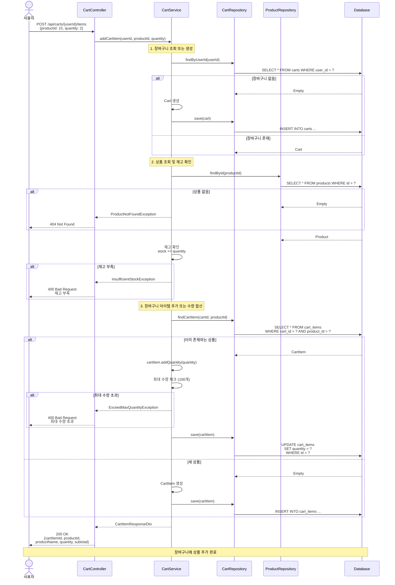
```mermaid
sequenceDiagram
    actor User as 사용자
    participant Controller as CartController
    participant Service as CartService
    participant CartRepo as CartRepository
    participant ProductRepo as ProductRepository
    participant DB as Database

    User->>Controller: POST /api/carts/{userId}/items<br/>{productId: 15, quantity: 2}
    Controller->>Service: addCartItem(userId, productId, quantity)

    Note over Service: 1. 장바구니 조회 또는 생성
    Service->>CartRepo: findByUserId(userId)
    CartRepo->>DB: SELECT * FROM carts WHERE user_id = ?

    alt 장바구니 없음
        DB-->>CartRepo: Empty
        Service->>Service: Cart 생성
        Service->>CartRepo: save(cart)
        CartRepo->>DB: INSERT INTO carts ...
    else 장바구니 존재
        DB-->>CartRepo: Cart
    end

    Note over Service: 2. 상품 조회 및 재고 확인
    Service->>ProductRepo: findById(productId)
    ProductRepo->>DB: SELECT * FROM products WHERE id = ?

    alt 상품 없음
        DB-->>ProductRepo: Empty
        Service-->>Controller: ProductNotFoundException
        Controller-->>User: 404 Not Found
    end

    DB-->>ProductRepo: Product
    Service->>Service: 재고 확인<br/>stock >= quantity

    alt 재고 부족
        Service-->>Controller: InsufficientStockException
        Controller-->>User: 400 Bad Request<br/>재고 부족
    end

    Note over Service: 3. 장바구니 아이템 추가 또는 수량 합산
    Service->>CartRepo: findCartItem(cartId, productId)
    CartRepo->>DB: SELECT * FROM cart_items<br/>WHERE cart_id = ? AND product_id = ?

    alt 이미 존재하는 상품
        DB-->>CartRepo: CartItem
        Service->>Service: cartItem.addQuantity(quantity)
        Service->>Service: 최대 수량 체크 (100개)

        alt 최대 수량 초과
            Service-->>Controller: ExceedMaxQuantityException
            Controller-->>User: 400 Bad Request<br/>최대 수량 초과
        end

        Service->>CartRepo: save(cartItem)
        CartRepo->>DB: UPDATE cart_items<br/>SET quantity = ?<br/>WHERE id = ?
    else 새 상품
        DB-->>CartRepo: Empty
        Service->>Service: CartItem 생성
        Service->>CartRepo: save(cartItem)
        CartRepo->>DB: INSERT INTO cart_items ...
    end

    Service-->>Controller: CartItemResponseDto
    Controller-->>User: 200 OK<br/>{cartItemId, productId,<br/>productName, quantity, subtotal}

    Note over User,DB: 장바구니에 상품 추가 완료
```

**핵심 로직**:
- 장바구니가 없으면 자동 생성
- 동일 상품 추가 시 수량 합산
- 재고 확인 및 최대 수량 제한 (100개)

---

### 3.2 장바구니 조회

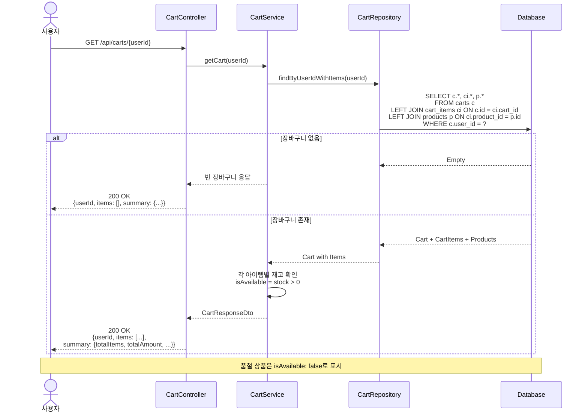
```mermaid
sequenceDiagram
    actor User as 사용자
    participant Controller as CartController
    participant Service as CartService
    participant Repository as CartRepository
    participant DB as Database

    User->>Controller: GET /api/carts/{userId}
    Controller->>Service: getCart(userId)

    Service->>Repository: findByUserIdWithItems(userId)
    Repository->>DB: SELECT c.*, ci.*, p.*<br/>FROM carts c<br/>LEFT JOIN cart_items ci ON c.id = ci.cart_id<br/>LEFT JOIN products p ON ci.product_id = p.id<br/>WHERE c.user_id = ?

    alt 장바구니 없음
        DB-->>Repository: Empty
        Service-->>Controller: 빈 장바구니 응답
        Controller-->>User: 200 OK<br/>{userId, items: [], summary: {...}}
    else 장바구니 존재
        DB-->>Repository: Cart + CartItems + Products
        Repository-->>Service: Cart with Items

        Service->>Service: 각 아이템별 재고 확인<br/>isAvailable = stock > 0

        Service-->>Controller: CartResponseDto
        Controller-->>User: 200 OK<br/>{userId, items: [...],<br/>summary: {totalItems, totalAmount, ...}}
    end

    Note over User,DB: 품절 상품은 isAvailable: false로 표시
```

**핵심 로직**:
- 장바구니와 아이템을 한 번의 쿼리로 조회 (JOIN)
- 각 아이템의 현재 재고 상태 확인
- 품절 여부를 isAvailable로 표시

---

## 4. 주문/결제 시스템

### 2.1 주문 생성 (정상 흐름)

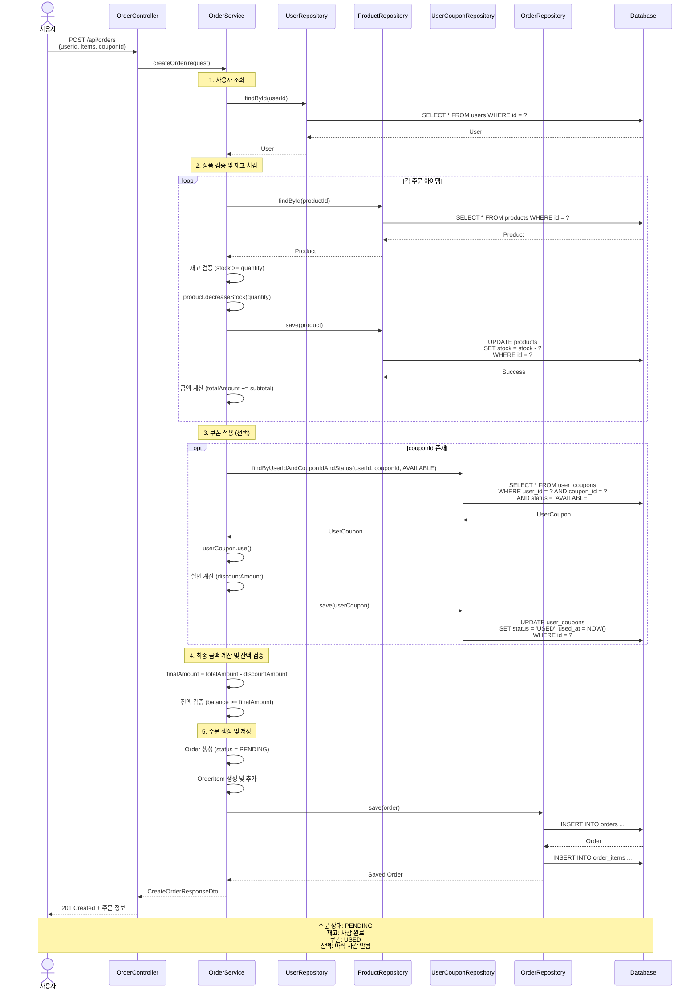
```mermaid
sequenceDiagram
    actor User as 사용자
    participant Controller as OrderController
    participant Service as OrderService
    participant UserRepo as UserRepository
    participant ProductRepo as ProductRepository
    participant CouponRepo as UserCouponRepository
    participant OrderRepo as OrderRepository
    participant DB as Database

    User->>Controller: POST /api/orders<br/>{userId, items, couponId}
    Controller->>Service: createOrder(request)

    Note over Service: 1. 사용자 조회
    Service->>UserRepo: findById(userId)
    UserRepo->>DB: SELECT * FROM users WHERE id = ?
    DB-->>UserRepo: User
    UserRepo-->>Service: User

    Note over Service: 2. 상품 검증 및 재고 차감
    loop 각 주문 아이템
        Service->>ProductRepo: findById(productId)
        ProductRepo->>DB: SELECT * FROM products WHERE id = ?
        DB-->>ProductRepo: Product
        ProductRepo-->>Service: Product

        Service->>Service: 재고 검증 (stock >= quantity)
        Service->>Service: product.decreaseStock(quantity)
        Service->>ProductRepo: save(product)
        ProductRepo->>DB: UPDATE products<br/>SET stock = stock - ?<br/>WHERE id = ?
        DB-->>ProductRepo: Success
        Service->>Service: 금액 계산 (totalAmount += subtotal)
    end

    Note over Service: 3. 쿠폰 적용 (선택)
    opt couponId 존재
        Service->>CouponRepo: findByUserIdAndCouponIdAndStatus(userId, couponId, AVAILABLE)
        CouponRepo->>DB: SELECT * FROM user_coupons<br/>WHERE user_id = ? AND coupon_id = ?<br/>AND status = 'AVAILABLE'
        DB-->>CouponRepo: UserCoupon
        CouponRepo-->>Service: UserCoupon

        Service->>Service: userCoupon.use()
        Service->>Service: 할인 계산 (discountAmount)
        Service->>CouponRepo: save(userCoupon)
        CouponRepo->>DB: UPDATE user_coupons<br/>SET status = 'USED', used_at = NOW()<br/>WHERE id = ?
    end

    Note over Service: 4. 최종 금액 계산 및 잔액 검증
    Service->>Service: finalAmount = totalAmount - discountAmount
    Service->>Service: 잔액 검증 (balance >= finalAmount)

    Note over Service: 5. 주문 생성 및 저장
    Service->>Service: Order 생성 (status = PENDING)
    Service->>Service: OrderItem 생성 및 추가
    Service->>OrderRepo: save(order)
    OrderRepo->>DB: INSERT INTO orders ...
    DB-->>OrderRepo: Order
    OrderRepo->>DB: INSERT INTO order_items ...
    OrderRepo-->>Service: Saved Order

    Service-->>Controller: CreateOrderResponseDto
    Controller-->>User: 201 Created + 주문 정보

    Note over User,DB: 주문 상태: PENDING<br/>재고: 차감 완료<br/>쿠폰: USED<br/>잔액: 아직 차감 안됨
```

**핵심 단계**:
1. 사용자 조회
2. 상품 검증 및 재고 차감 (즉시)
3. 쿠폰 적용 및 사용 처리
4. 최종 금액 계산 및 잔액 검증
5. 주문 생성 (PENDING 상태)

---

### 2.2 주문 생성 (재고 부족 예외)

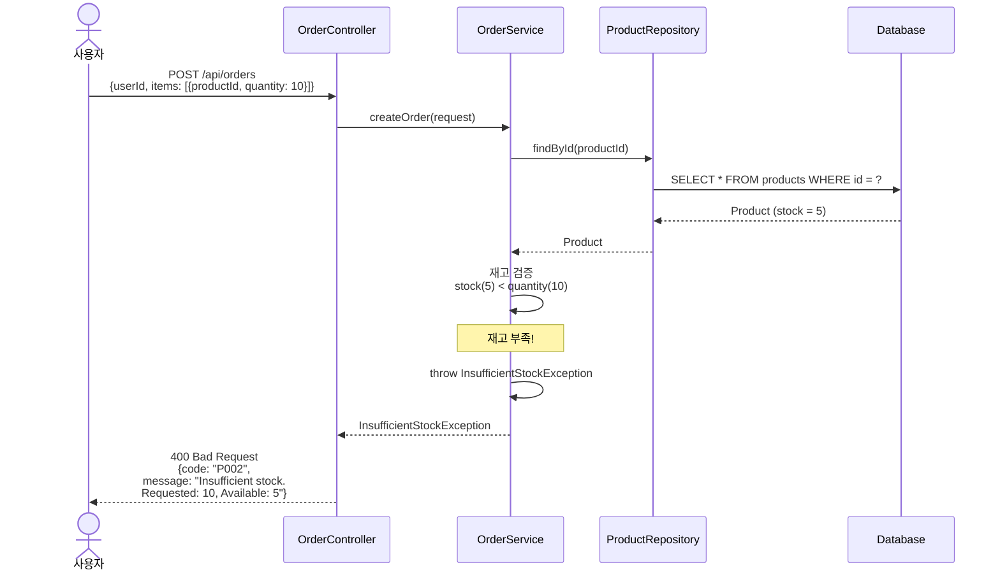
```mermaid
sequenceDiagram
    actor User as 사용자
    participant Controller as OrderController
    participant Service as OrderService
    participant ProductRepo as ProductRepository
    participant DB as Database

    User->>Controller: POST /api/orders<br/>{userId, items: [{productId, quantity: 10}]}
    Controller->>Service: createOrder(request)

    Service->>ProductRepo: findById(productId)
    ProductRepo->>DB: SELECT * FROM products WHERE id = ?
    DB-->>ProductRepo: Product (stock = 5)
    ProductRepo-->>Service: Product

    Service->>Service: 재고 검증<br/>stock(5) < quantity(10)

    Note over Service: 재고 부족!
    Service->>Service: throw InsufficientStockException
    Service-->>Controller: InsufficientStockException
    Controller-->>User: 400 Bad Request<br/>{code: "P002",<br/>message: "Insufficient stock.<br/>Requested: 10, Available: 5"}
```

**에러 처리**:
- 재고 부족 시 주문 생성 거부
- 명확한 에러 메시지 (요청 수량 vs 가능 수량)

---

### 2.3 주문 생성 (잔액 부족 예외)

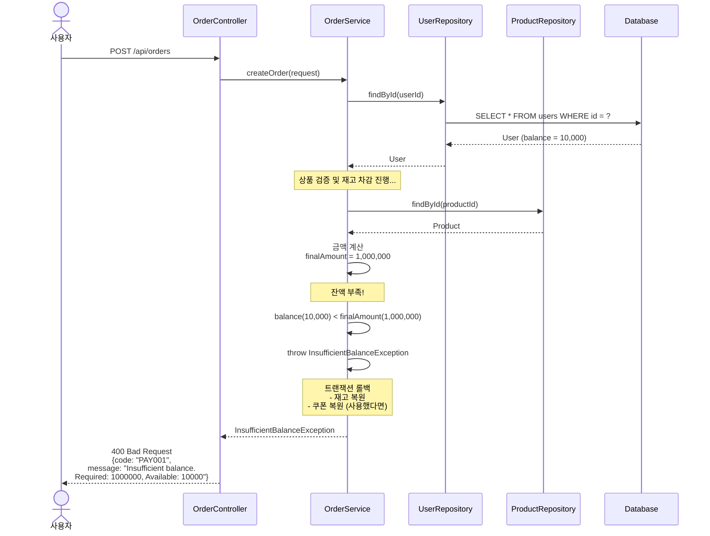
```mermaid
sequenceDiagram
    actor User as 사용자
    participant Controller as OrderController
    participant Service as OrderService
    participant UserRepo as UserRepository
    participant ProductRepo as ProductRepository
    participant DB as Database

    User->>Controller: POST /api/orders
    Controller->>Service: createOrder(request)

    Service->>UserRepo: findById(userId)
    UserRepo->>DB: SELECT * FROM users WHERE id = ?
    DB-->>UserRepo: User (balance = 10,000)
    UserRepo-->>Service: User

    Note over Service: 상품 검증 및 재고 차감 진행...
    Service->>ProductRepo: findById(productId)
    ProductRepo-->>Service: Product

    Service->>Service: 금액 계산<br/>finalAmount = 1,000,000

    Note over Service: 잔액 부족!
    Service->>Service: balance(10,000) < finalAmount(1,000,000)
    Service->>Service: throw InsufficientBalanceException

    Note over Service: 트랜잭션 롤백<br/>- 재고 복원<br/>- 쿠폰 복원 (사용했다면)

    Service-->>Controller: InsufficientBalanceException
    Controller-->>User: 400 Bad Request<br/>{code: "PAY001",<br/>message: "Insufficient balance.<br/>Required: 1000000, Available: 10000"}
```

**에러 처리**:
- 잔액 부족 시 트랜잭션 롤백
- 재고 및 쿠폰 자동 복원

---

### 4.1 결제 처리 (성공)

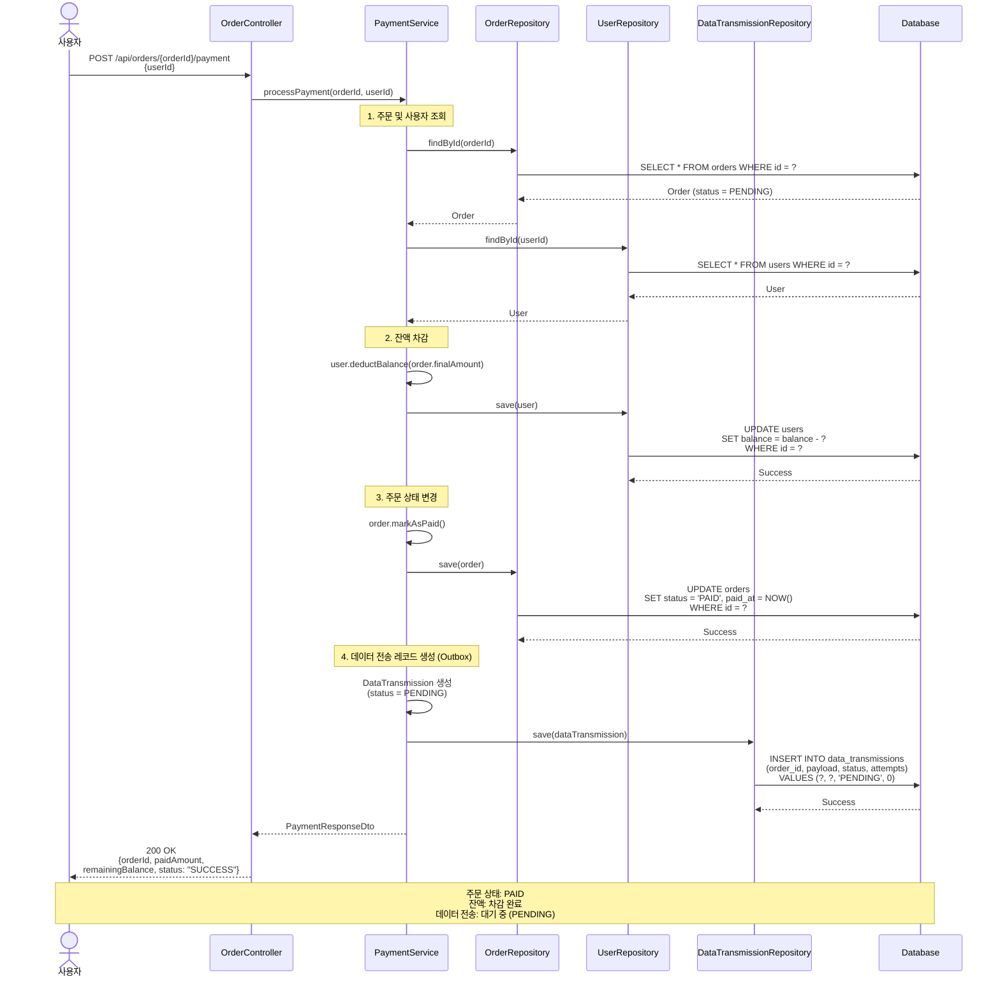
```mermaid
sequenceDiagram
    actor User as 사용자
    participant Controller as OrderController
    participant Service as PaymentService
    participant OrderRepo as OrderRepository
    participant UserRepo as UserRepository
    participant TransRepo as DataTransmissionRepository
    participant DB as Database

    User->>Controller: POST /api/orders/{orderId}/payment<br/>{userId}
    Controller->>Service: processPayment(orderId, userId)

    Note over Service: 1. 주문 및 사용자 조회
    Service->>OrderRepo: findById(orderId)
    OrderRepo->>DB: SELECT * FROM orders WHERE id = ?
    DB-->>OrderRepo: Order (status = PENDING)
    OrderRepo-->>Service: Order

    Service->>UserRepo: findById(userId)
    UserRepo->>DB: SELECT * FROM users WHERE id = ?
    DB-->>UserRepo: User
    UserRepo-->>Service: User

    Note over Service: 2. 잔액 차감
    Service->>Service: user.deductBalance(order.finalAmount)
    Service->>UserRepo: save(user)
    UserRepo->>DB: UPDATE users<br/>SET balance = balance - ?<br/>WHERE id = ?
    DB-->>UserRepo: Success

    Note over Service: 3. 주문 상태 변경
    Service->>Service: order.markAsPaid()
    Service->>OrderRepo: save(order)
    OrderRepo->>DB: UPDATE orders<br/>SET status = 'PAID', paid_at = NOW()<br/>WHERE id = ?
    DB-->>OrderRepo: Success

    Note over Service: 4. 데이터 전송 레코드 생성 (Outbox)
    Service->>Service: DataTransmission 생성<br/>(status = PENDING)
    Service->>TransRepo: save(dataTransmission)
    TransRepo->>DB: INSERT INTO data_transmissions<br/>(order_id, payload, status, attempts)<br/>VALUES (?, ?, 'PENDING', 0)
    DB-->>TransRepo: Success

    Service-->>Controller: PaymentResponseDto
    Controller-->>User: 200 OK<br/>{orderId, paidAmount,<br/>remainingBalance, status: "SUCCESS"}

    Note over User,DB: 주문 상태: PAID<br/>잔액: 차감 완료<br/>데이터 전송: 대기 중 (PENDING)
```

**핵심 단계**:
1. 주문 및 사용자 조회
2. 잔액 차감
3. 주문 상태 변경 (PENDING → PAID)
4. 데이터 전송 레코드 생성 (Outbox Pattern)

---

### 4.2 결제 실패 및 보상 트랜잭션

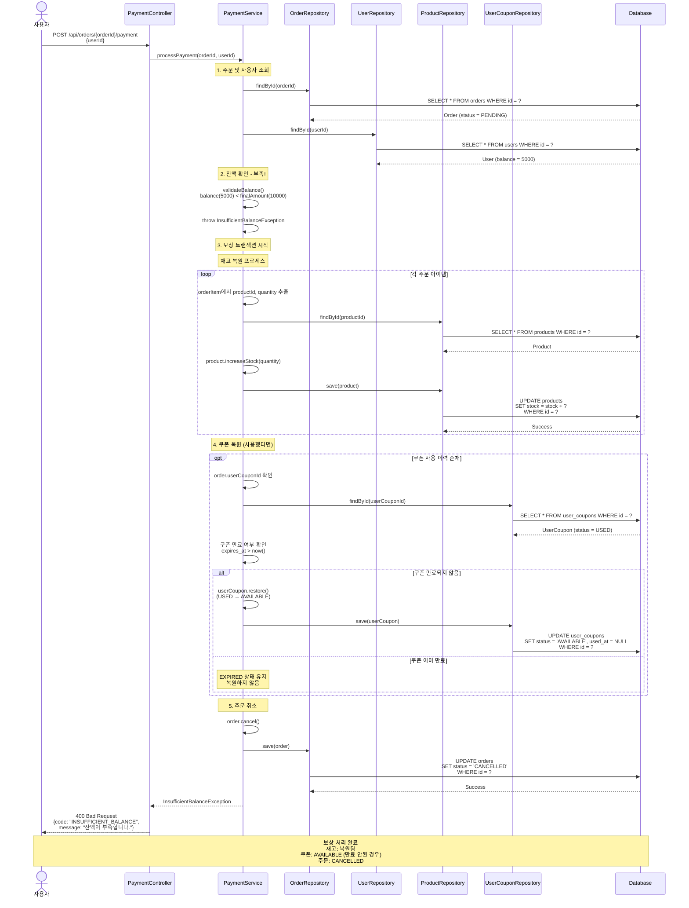
```mermaid
sequenceDiagram
    actor User as 사용자
    participant Controller as PaymentController
    participant Service as PaymentService
    participant OrderRepo as OrderRepository
    participant UserRepo as UserRepository
    participant ProductRepo as ProductRepository
    participant CouponRepo as UserCouponRepository
    participant DB as Database

    User->>Controller: POST /api/orders/{orderId}/payment<br/>{userId}
    Controller->>Service: processPayment(orderId, userId)

    Note over Service: 1. 주문 및 사용자 조회
    Service->>OrderRepo: findById(orderId)
    OrderRepo->>DB: SELECT * FROM orders WHERE id = ?
    DB-->>OrderRepo: Order (status = PENDING)

    Service->>UserRepo: findById(userId)
    UserRepo->>DB: SELECT * FROM users WHERE id = ?
    DB-->>UserRepo: User (balance = 5000)

    Note over Service: 2. 잔액 확인 - 부족!
    Service->>Service: validateBalance()<br/>balance(5000) < finalAmount(10000)
    Service->>Service: throw InsufficientBalanceException

    Note over Service: 3. 보상 트랜잭션 시작
    Note over Service: 재고 복원 프로세스

    loop 각 주문 아이템
        Service->>Service: orderItem에서 productId, quantity 추출
        Service->>ProductRepo: findById(productId)
        ProductRepo->>DB: SELECT * FROM products WHERE id = ?
        DB-->>ProductRepo: Product

        Service->>Service: product.increaseStock(quantity)
        Service->>ProductRepo: save(product)
        ProductRepo->>DB: UPDATE products<br/>SET stock = stock + ?<br/>WHERE id = ?
        DB-->>ProductRepo: Success
    end

    Note over Service: 4. 쿠폰 복원 (사용했다면)
    opt 쿠폰 사용 이력 존재
        Service->>Service: order.userCouponId 확인
        Service->>CouponRepo: findById(userCouponId)
        CouponRepo->>DB: SELECT * FROM user_coupons WHERE id = ?
        DB-->>CouponRepo: UserCoupon (status = USED)

        Service->>Service: 쿠폰 만료 여부 확인<br/>expires_at > now()

        alt 쿠폰 만료되지 않음
            Service->>Service: userCoupon.restore()<br/>(USED → AVAILABLE)
            Service->>CouponRepo: save(userCoupon)
            CouponRepo->>DB: UPDATE user_coupons<br/>SET status = 'AVAILABLE', used_at = NULL<br/>WHERE id = ?
        else 쿠폰 이미 만료
            Note over Service: EXPIRED 상태 유지<br/>복원하지 않음
        end
    end

    Note over Service: 5. 주문 취소
    Service->>Service: order.cancel()
    Service->>OrderRepo: save(order)
    OrderRepo->>DB: UPDATE orders<br/>SET status = 'CANCELLED'<br/>WHERE id = ?
    DB-->>OrderRepo: Success

    Service-->>Controller: InsufficientBalanceException
    Controller-->>User: 400 Bad Request<br/>{code: "INSUFFICIENT_BALANCE",<br/>message: "잔액이 부족합니다."}

    Note over User,DB: 보상 처리 완료<br/>재고: 복원됨<br/>쿠폰: AVAILABLE (만료 안된 경우)<br/>주문: CANCELLED
```

**보상 트랜잭션 핵심 로직**:
1. **재고 복원** - 주문 시 차감했던 모든 상품의 재고를 원래대로 복원
2. **쿠폰 복원** - 사용한 쿠폰을 AVAILABLE 상태로 복원 (만료되지 않은 경우만)
3. **주문 취소** - 주문 상태를 CANCELLED로 변경

**보상 처리 시나리오**:
- 결제 실패 (잔액 부족)
- 외부 시스템 연동 실패 (치명적 오류)
- 기타 시스템 오류

---

### 4.3 주문 취소 (PENDING 상태)

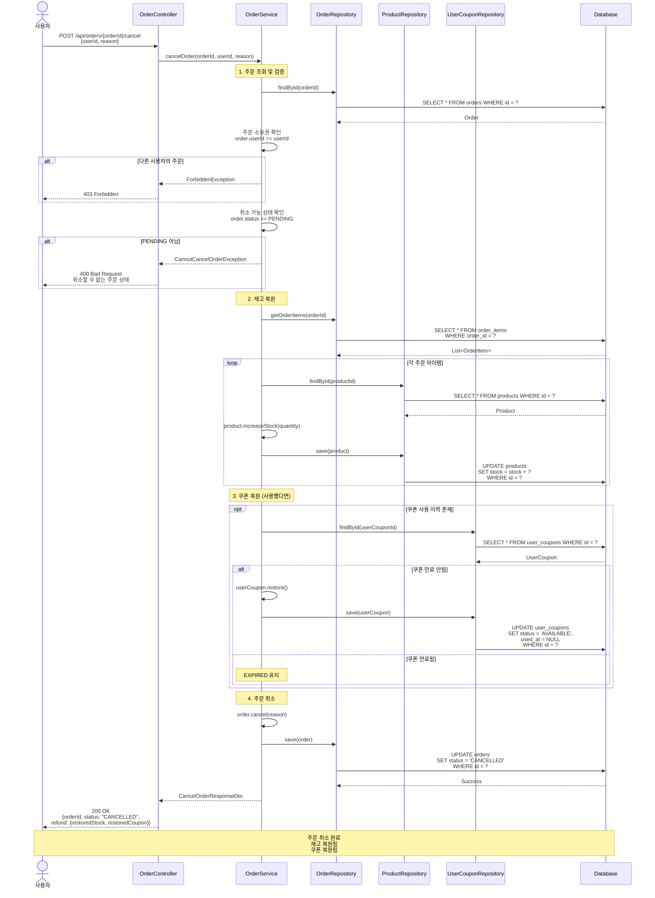
```mermaid
sequenceDiagram
    actor User as 사용자
    participant Controller as OrderController
    participant Service as OrderService
    participant OrderRepo as OrderRepository
    participant ProductRepo as ProductRepository
    participant CouponRepo as UserCouponRepository
    participant DB as Database

    User->>Controller: POST /api/orders/{orderId}/cancel<br/>{userId, reason}
    Controller->>Service: cancelOrder(orderId, userId, reason)

    Note over Service: 1. 주문 조회 및 검증
    Service->>OrderRepo: findById(orderId)
    OrderRepo->>DB: SELECT * FROM orders WHERE id = ?
    DB-->>OrderRepo: Order

    Service->>Service: 주문 소유권 확인<br/>order.userId == userId

    alt 다른 사용자의 주문
        Service-->>Controller: ForbiddenException
        Controller-->>User: 403 Forbidden
    end

    Service->>Service: 취소 가능 상태 확인<br/>order.status == PENDING

    alt PENDING 아님
        Service-->>Controller: CannotCancelOrderException
        Controller-->>User: 400 Bad Request<br/>취소할 수 없는 주문 상태
    end

    Note over Service: 2. 재고 복원
    Service->>OrderRepo: getOrderItems(orderId)
    OrderRepo->>DB: SELECT * FROM order_items<br/>WHERE order_id = ?
    DB-->>OrderRepo: List<OrderItem>

    loop 각 주문 아이템
        Service->>ProductRepo: findById(productId)
        ProductRepo->>DB: SELECT * FROM products WHERE id = ?
        DB-->>ProductRepo: Product

        Service->>Service: product.increaseStock(quantity)
        Service->>ProductRepo: save(product)
        ProductRepo->>DB: UPDATE products<br/>SET stock = stock + ?<br/>WHERE id = ?
    end

    Note over Service: 3. 쿠폰 복원 (사용했다면)
    opt 쿠폰 사용 이력 존재
        Service->>CouponRepo: findById(userCouponId)
        CouponRepo->>DB: SELECT * FROM user_coupons WHERE id = ?
        DB-->>CouponRepo: UserCoupon

        alt 쿠폰 만료 안됨
            Service->>Service: userCoupon.restore()
            Service->>CouponRepo: save(userCoupon)
            CouponRepo->>DB: UPDATE user_coupons<br/>SET status = 'AVAILABLE',<br/>used_at = NULL<br/>WHERE id = ?
        else 쿠폰 만료됨
            Note over Service: EXPIRED 유지
        end
    end

    Note over Service: 4. 주문 취소
    Service->>Service: order.cancel(reason)
    Service->>OrderRepo: save(order)
    OrderRepo->>DB: UPDATE orders<br/>SET status = 'CANCELLED'<br/>WHERE id = ?
    DB-->>OrderRepo: Success

    Service-->>Controller: CancelOrderResponseDto
    Controller-->>User: 200 OK<br/>{orderId, status: "CANCELLED",<br/>refund: {restoredStock, restoredCoupon}}

    Note over User,DB: 주문 취소 완료<br/>재고 복원됨<br/>쿠폰 복원됨
```

**주문 취소 핵심 로직**:
1. **취소 가능 여부 확인** - PENDING 상태만 취소 가능
2. **재고 복원** - 차감했던 재고 원복
3. **쿠폰 복원** - 사용한 쿠폰 AVAILABLE로 복원 (만료 안된 경우)
4. **주문 상태 변경** - CANCELLED로 변경

**제한 사항**:
- PAID 상태 주문은 취소 불가 (별도 환불 프로세스 필요)
- 본인의 주문만 취소 가능
- 취소 사유는 선택사항

---

### 4.4 주문 조회

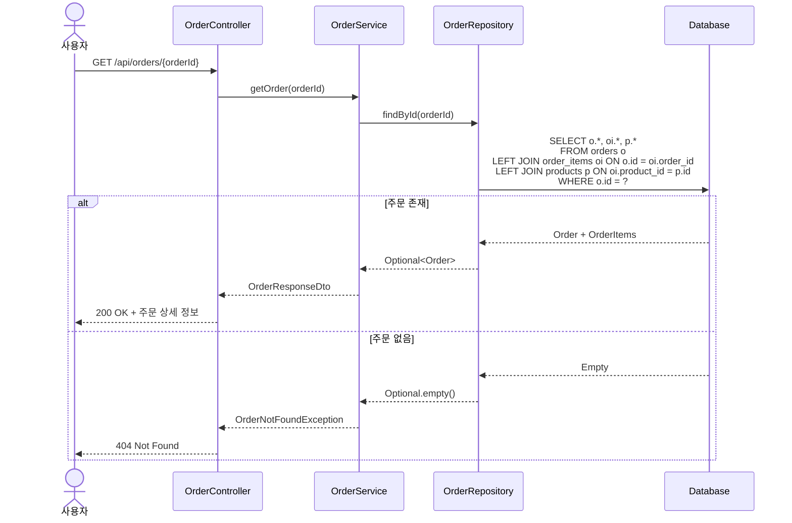
```mermaid
sequenceDiagram
    actor User as 사용자
    participant Controller as OrderController
    participant Service as OrderService
    participant Repository as OrderRepository
    participant DB as Database

    User->>Controller: GET /api/orders/{orderId}
    Controller->>Service: getOrder(orderId)
    Service->>Repository: findById(orderId)
    Repository->>DB: SELECT o.*, oi.*, p.*<br/>FROM orders o<br/>LEFT JOIN order_items oi ON o.id = oi.order_id<br/>LEFT JOIN products p ON oi.product_id = p.id<br/>WHERE o.id = ?

    alt 주문 존재
        DB-->>Repository: Order + OrderItems
        Repository-->>Service: Optional<Order>
        Service-->>Controller: OrderResponseDto
        Controller-->>User: 200 OK + 주문 상세 정보
    else 주문 없음
        DB-->>Repository: Empty
        Repository-->>Service: Optional.empty()
        Service-->>Controller: OrderNotFoundException
        Controller-->>User: 404 Not Found
    end
```

---

### 4.5 사용자별 주문 목록 조회

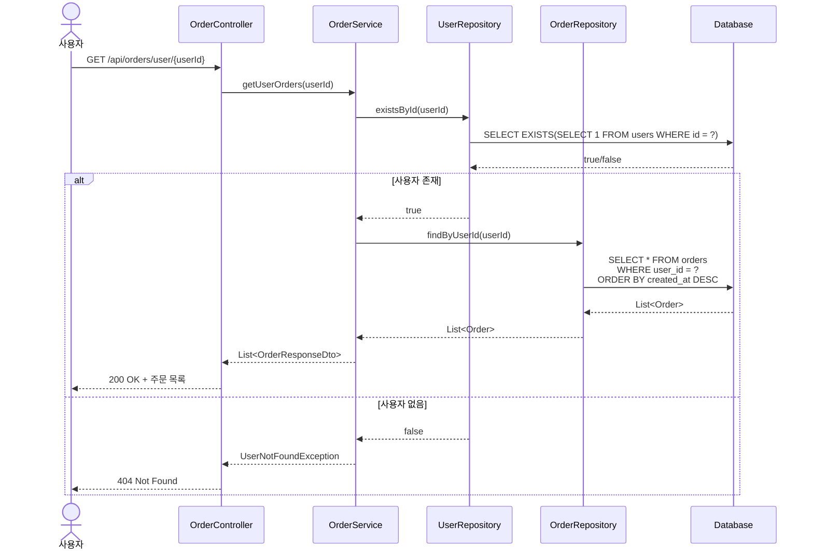
```mermaid
sequenceDiagram
    actor User as 사용자
    participant Controller as OrderController
    participant Service as OrderService
    participant UserRepo as UserRepository
    participant OrderRepo as OrderRepository
    participant DB as Database

    User->>Controller: GET /api/orders/user/{userId}
    Controller->>Service: getUserOrders(userId)

    Service->>UserRepo: existsById(userId)
    UserRepo->>DB: SELECT EXISTS(SELECT 1 FROM users WHERE id = ?)
    DB-->>UserRepo: true/false

    alt 사용자 존재
        UserRepo-->>Service: true
        Service->>OrderRepo: findByUserId(userId)
        OrderRepo->>DB: SELECT * FROM orders<br/>WHERE user_id = ?<br/>ORDER BY created_at DESC
        DB-->>OrderRepo: List<Order>
        OrderRepo-->>Service: List<Order>
        Service-->>Controller: List<OrderResponseDto>
        Controller-->>User: 200 OK + 주문 목록
    else 사용자 없음
        UserRepo-->>Service: false
        Service-->>Controller: UserNotFoundException
        Controller-->>User: 404 Not Found
    end
```

---

## 5. 쿠폰 시스템

### 5.1 쿠폰 발급 (선착순)

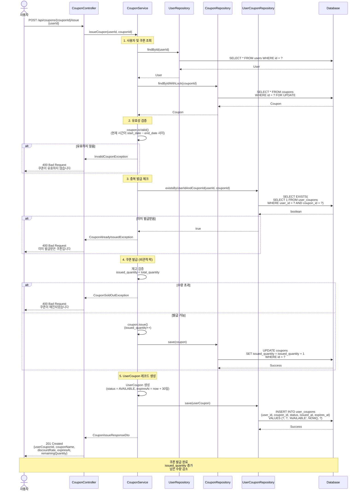
```mermaid
sequenceDiagram
    actor User as 사용자
    participant Controller as CouponController
    participant Service as CouponService
    participant UserRepo as UserRepository
    participant CouponRepo as CouponRepository
    participant UserCouponRepo as UserCouponRepository
    participant DB as Database

    User->>Controller: POST /api/coupons/{couponId}/issue<br/>{userId}
    Controller->>Service: issueCoupon(userId, couponId)

    Note over Service: 1. 사용자 및 쿠폰 조회
    Service->>UserRepo: findById(userId)
    UserRepo->>DB: SELECT * FROM users WHERE id = ?
    DB-->>UserRepo: User
    UserRepo-->>Service: User

    Service->>CouponRepo: findByIdWithLock(couponId)
    CouponRepo->>DB: SELECT * FROM coupons<br/>WHERE id = ? FOR UPDATE
    DB-->>CouponRepo: Coupon
    CouponRepo-->>Service: Coupon

    Note over Service: 2. 유효성 검증
    Service->>Service: coupon.isValid()<br/>(현재 시간이 start_date ~ end_date 사이)

    alt 유효하지 않음
        Service-->>Controller: InvalidCouponException
        Controller-->>User: 400 Bad Request<br/>쿠폰이 유효하지 않습니다
    end

    Note over Service: 3. 중복 발급 체크
    Service->>UserCouponRepo: existsByUserIdAndCouponId(userId, couponId)
    UserCouponRepo->>DB: SELECT EXISTS(<br/>SELECT 1 FROM user_coupons<br/>WHERE user_id = ? AND coupon_id = ?)
    DB-->>UserCouponRepo: boolean

    alt 이미 발급받음
        UserCouponRepo-->>Service: true
        Service-->>Controller: CouponAlreadyIssuedException
        Controller-->>User: 400 Bad Request<br/>이미 발급받은 쿠폰입니다
    end

    Note over Service: 4. 쿠폰 발급 (비관적 락)
    Service->>Service: 재고 검증<br/>issued_quantity < total_quantity

    alt 수량 초과
        Service-->>Controller: CouponSoldOutException
        Controller-->>User: 400 Bad Request<br/>쿠폰이 매진되었습니다
    else 발급 가능
        Service->>Service: coupon.issue()<br/>(issued_quantity++)
        Service->>CouponRepo: save(coupon)
        CouponRepo->>DB: UPDATE coupons<br/>SET issued_quantity = issued_quantity + 1<br/>WHERE id = ?
        DB-->>CouponRepo: Success
    end

    Note over Service: 5. UserCoupon 레코드 생성
    Service->>Service: UserCoupon 생성<br/>(status = AVAILABLE, expiresAt = now + 30일)
    Service->>UserCouponRepo: save(userCoupon)
    UserCouponRepo->>DB: INSERT INTO user_coupons<br/>(user_id, coupon_id, status, issued_at, expires_at)<br/>VALUES (?, ?, 'AVAILABLE', NOW(), ?)
    DB-->>UserCouponRepo: Success

    Service-->>Controller: CouponIssueResponseDto
    Controller-->>User: 201 Created<br/>{userCouponId, couponName,<br/>discountRate, expiresAt,<br/>remainingQuantity}

    Note over User,DB: 쿠폰 발급 완료<br/>issued_quantity 증가<br/>남은 수량 감소
```

**핵심 로직**:
- 비관적 락으로 동시성 제어 (`FOR UPDATE`)
- `issued_quantity < total_quantity` 조건 체크
- 중복 발급 방지 (`user_id`, `coupon_id` 조합)
- 발급 후 30일 자동 만료

---

### 5.2 보유 쿠폰 조회

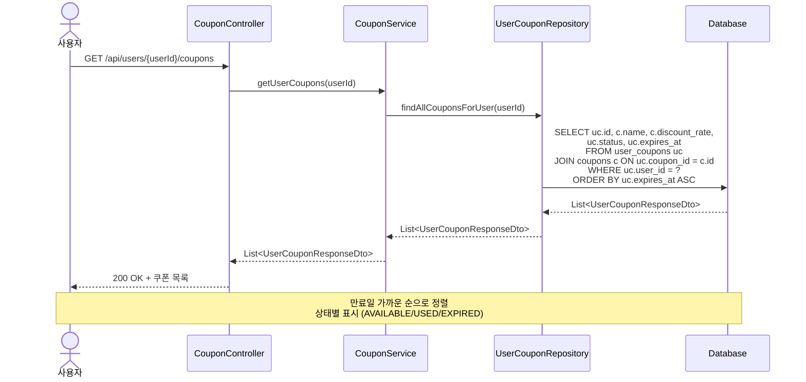
```mermaid
sequenceDiagram
    actor User as 사용자
    participant Controller as CouponController
    participant Service as CouponService
    participant Repository as UserCouponRepository
    participant DB as Database

    User->>Controller: GET /api/users/{userId}/coupons
    Controller->>Service: getUserCoupons(userId)
    Service->>Repository: findAllCouponsForUser(userId)
    Repository->>DB: SELECT uc.id, c.name, c.discount_rate,<br/>uc.status, uc.expires_at<br/>FROM user_coupons uc<br/>JOIN coupons c ON uc.coupon_id = c.id<br/>WHERE uc.user_id = ?<br/>ORDER BY uc.expires_at ASC

    DB-->>Repository: List<UserCouponResponseDto>
    Repository-->>Service: List<UserCouponResponseDto>
    Service-->>Controller: List<UserCouponResponseDto>
    Controller-->>User: 200 OK + 쿠폰 목록

    Note over User,DB: 만료일 가까운 순으로 정렬<br/>상태별 표시 (AVAILABLE/USED/EXPIRED)
```

---

### 5.3 쿠폰 목록 조회

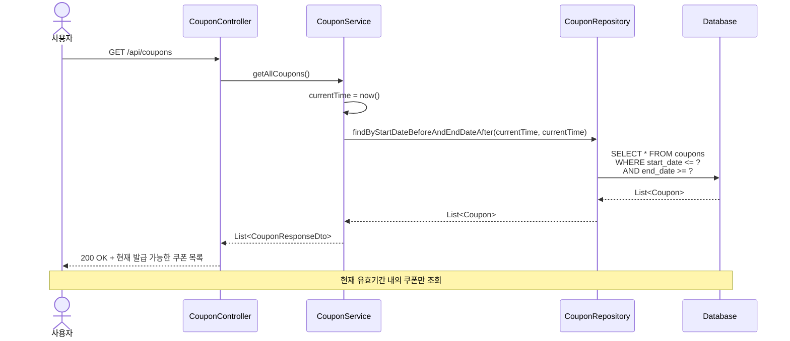
```mermaid
sequenceDiagram
    actor User as 사용자
    participant Controller as CouponController
    participant Service as CouponService
    participant Repository as CouponRepository
    participant DB as Database

    User->>Controller: GET /api/coupons
    Controller->>Service: getAllCoupons()
    Service->>Service: currentTime = now()
    Service->>Repository: findByStartDateBeforeAndEndDateAfter(currentTime, currentTime)
    Repository->>DB: SELECT * FROM coupons<br/>WHERE start_date <= ?<br/>AND end_date >= ?

    DB-->>Repository: List<Coupon>
    Repository-->>Service: List<Coupon>
    Service-->>Controller: List<CouponResponseDto>
    Controller-->>User: 200 OK + 현재 발급 가능한 쿠폰 목록

    Note over User,DB: 현재 유효기간 내의 쿠폰만 조회
```

---

## 6. 배송 관리

### 6.1 배송 정보 생성 (주문 완료 시 자동 생성)

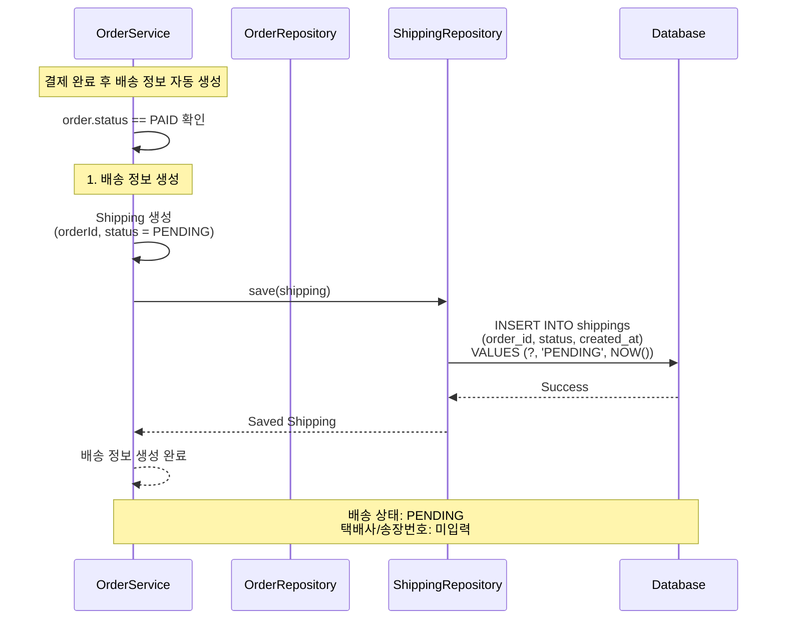
```mermaid
sequenceDiagram
    participant Service as OrderService
    participant OrderRepo as OrderRepository
    participant ShippingRepo as ShippingRepository
    participant DB as Database

    Note over Service: 결제 완료 후 배송 정보 자동 생성

    Service->>Service: order.status == PAID 확인

    Note over Service: 1. 배송 정보 생성
    Service->>Service: Shipping 생성<br/>(orderId, status = PENDING)
    Service->>ShippingRepo: save(shipping)
    ShippingRepo->>DB: INSERT INTO shippings<br/>(order_id, status, created_at)<br/>VALUES (?, 'PENDING', NOW())
    DB-->>ShippingRepo: Success
    ShippingRepo-->>Service: Saved Shipping

    Service-->>Service: 배송 정보 생성 완료

    Note over Service,DB: 배송 상태: PENDING<br/>택배사/송장번호: 미입력
```

**핵심 로직**:
- 주문 결제 완료 시 자동으로 배송 정보 생성
- 초기 상태는 PENDING
- 택배사 및 송장번호는 추후 입력

---

### 6.2 배송 시작 처리

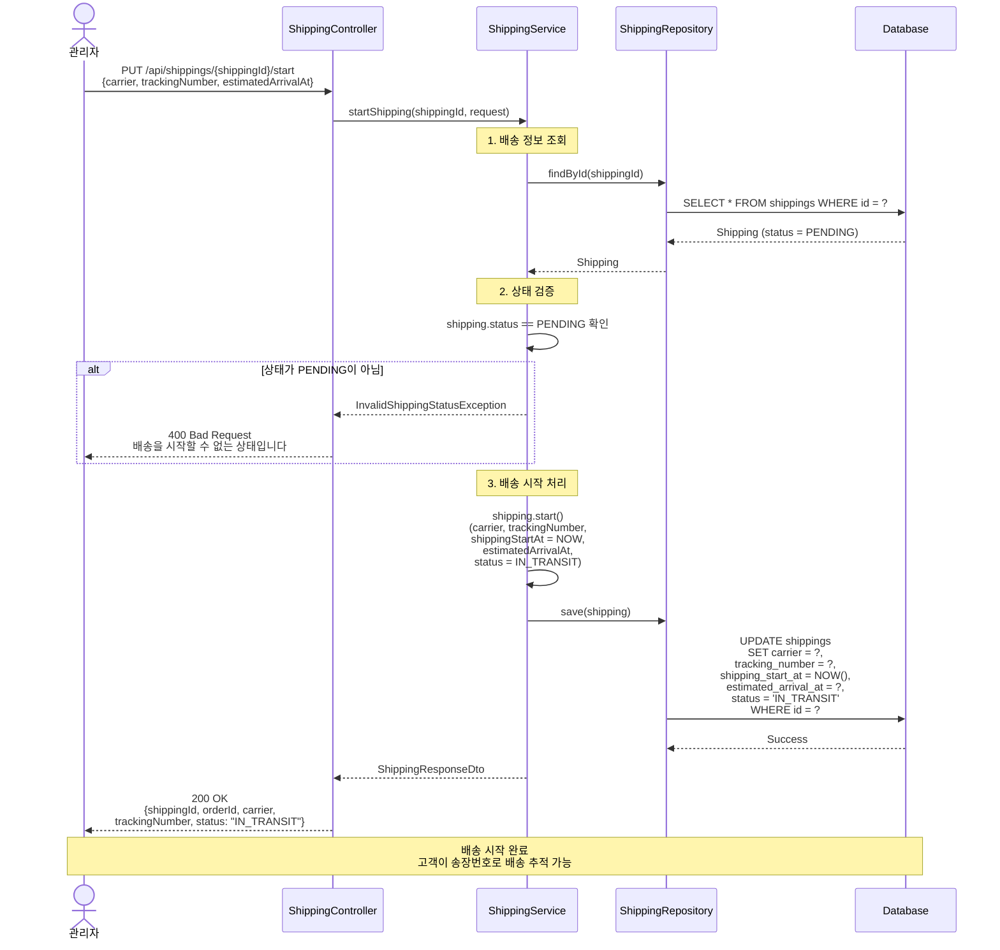
```mermaid
sequenceDiagram
    actor Admin as 관리자
    participant Controller as ShippingController
    participant Service as ShippingService
    participant Repository as ShippingRepository
    participant DB as Database

    Admin->>Controller: PUT /api/shippings/{shippingId}/start<br/>{carrier, trackingNumber, estimatedArrivalAt}
    Controller->>Service: startShipping(shippingId, request)

    Note over Service: 1. 배송 정보 조회
    Service->>Repository: findById(shippingId)
    Repository->>DB: SELECT * FROM shippings WHERE id = ?
    DB-->>Repository: Shipping (status = PENDING)
    Repository-->>Service: Shipping

    Note over Service: 2. 상태 검증
    Service->>Service: shipping.status == PENDING 확인

    alt 상태가 PENDING이 아님
        Service-->>Controller: InvalidShippingStatusException
        Controller-->>Admin: 400 Bad Request<br/>배송을 시작할 수 없는 상태입니다
    end

    Note over Service: 3. 배송 시작 처리
    Service->>Service: shipping.start()<br/>(carrier, trackingNumber,<br/>shippingStartAt = NOW,<br/>estimatedArrivalAt,<br/>status = IN_TRANSIT)
    Service->>Repository: save(shipping)
    Repository->>DB: UPDATE shippings<br/>SET carrier = ?,<br/>tracking_number = ?,<br/>shipping_start_at = NOW(),<br/>estimated_arrival_at = ?,<br/>status = 'IN_TRANSIT'<br/>WHERE id = ?
    DB-->>Repository: Success

    Service-->>Controller: ShippingResponseDto
    Controller-->>Admin: 200 OK<br/>{shippingId, orderId, carrier,<br/>trackingNumber, status: "IN_TRANSIT"}

    Note over Admin,DB: 배송 시작 완료<br/>고객이 송장번호로 배송 추적 가능
```

**핵심 로직**:
- PENDING 상태의 배송만 시작 가능
- 택배사, 송장번호, 도착 예정일 입력
- 배송 시작일 자동 기록
- 상태를 IN_TRANSIT으로 변경

---

### 6.3 배송 완료 처리

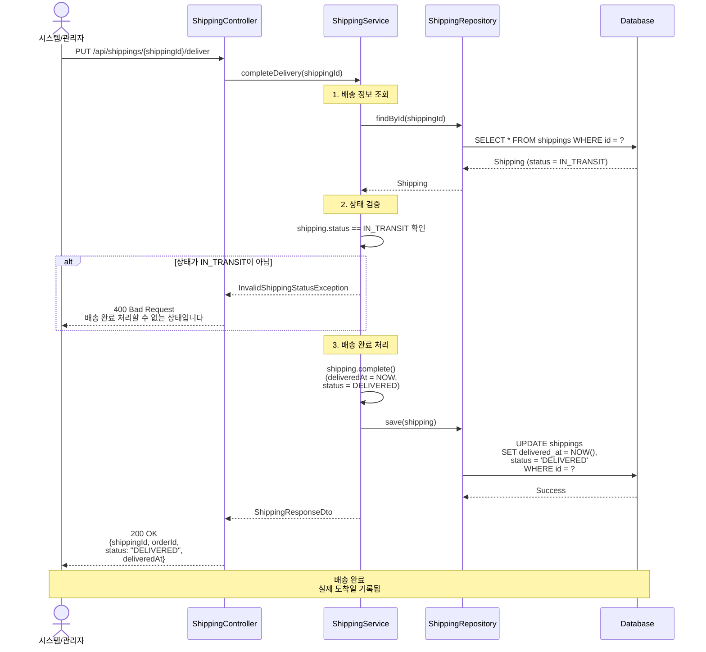
```mermaid
sequenceDiagram
    actor System as 시스템/관리자
    participant Controller as ShippingController
    participant Service as ShippingService
    participant Repository as ShippingRepository
    participant DB as Database

    System->>Controller: PUT /api/shippings/{shippingId}/deliver
    Controller->>Service: completeDelivery(shippingId)

    Note over Service: 1. 배송 정보 조회
    Service->>Repository: findById(shippingId)
    Repository->>DB: SELECT * FROM shippings WHERE id = ?
    DB-->>Repository: Shipping (status = IN_TRANSIT)
    Repository-->>Service: Shipping

    Note over Service: 2. 상태 검증
    Service->>Service: shipping.status == IN_TRANSIT 확인

    alt 상태가 IN_TRANSIT이 아님
        Service-->>Controller: InvalidShippingStatusException
        Controller-->>System: 400 Bad Request<br/>배송 완료 처리할 수 없는 상태입니다
    end

    Note over Service: 3. 배송 완료 처리
    Service->>Service: shipping.complete()<br/>(deliveredAt = NOW,<br/>status = DELIVERED)
    Service->>Repository: save(shipping)
    Repository->>DB: UPDATE shippings<br/>SET delivered_at = NOW(),<br/>status = 'DELIVERED'<br/>WHERE id = ?
    DB-->>Repository: Success

    Service-->>Controller: ShippingResponseDto
    Controller-->>System: 200 OK<br/>{shippingId, orderId,<br/>status: "DELIVERED",<br/>deliveredAt}

    Note over System,DB: 배송 완료<br/>실제 도착일 기록됨
```

**핵심 로직**:
- IN_TRANSIT 상태의 배송만 완료 처리 가능
- 실제 도착일 자동 기록
- 상태를 DELIVERED로 변경

---

### 6.4 배송 조회

```mermaid
sequenceDiagram
    actor User as 사용자
    participant Controller as ShippingController
    participant Service as ShippingService
    participant Repository as ShippingRepository
    participant DB as Database

    User->>Controller: GET /api/orders/{orderId}/shipping
    Controller->>Service: getShippingByOrderId(orderId)

    Service->>Repository: findByOrderId(orderId)
    Repository->>DB: SELECT * FROM shippings<br/>WHERE order_id = ?

    alt 배송 정보 존재
        DB-->>Repository: Shipping
        Repository-->>Service: Optional<Shipping>
        Service-->>Controller: ShippingResponseDto
        Controller-->>User: 200 OK<br/>{shippingId, orderId, carrier,<br/>trackingNumber, status,<br/>shippingStartAt, estimatedArrivalAt,<br/>deliveredAt}
    else 배송 정보 없음
        DB-->>Repository: Empty
        Repository-->>Service: Optional.empty()
        Service-->>Controller: ShippingNotFoundException
        Controller-->>User: 404 Not Found<br/>배송 정보가 존재하지 않습니다
    end

    Note over User,DB: 배송 상태별 정보:<br/>PENDING: 배송 준비 중<br/>IN_TRANSIT: 배송 중 (송장번호 제공)<br/>DELIVERED: 배송 완료 (실제 도착일 제공)
```

**핵심 로직**:
- 주문 ID로 배송 정보 조회
- 배송 상태에 따라 다른 정보 제공
  - PENDING: 배송 준비 중
  - IN_TRANSIT: 택배사, 송장번호, 도착 예정일
  - DELIVERED: 실제 도착일 포함

---

## 7. 데이터 연동

### 7.1 데이터 전송 (Outbox Pattern)

```mermaid
sequenceDiagram
    participant Scheduler as 배치 스케줄러
    participant Service as DataTransmissionService
    participant Repository as DataTransmissionRepository
    participant ExternalAPI as 외부 시스템
    participant DB as Database

    Note over Scheduler: 주기적 실행 (예: 1분마다)

    Scheduler->>Service: processPendingTransmissions()

    Note over Service: 1. 전송 대상 조회
    Service->>Repository: findByStatusIn([PENDING, FAILED])<br/>AND attempts < 3
    Repository->>DB: SELECT * FROM data_transmissions<br/>WHERE status IN ('PENDING', 'FAILED')<br/>AND attempts < 3<br/>ORDER BY created_at ASC
    DB-->>Repository: List<DataTransmission>
    Repository-->>Service: List<DataTransmission>

    loop 각 전송 레코드
        Note over Service: 2. 외부 시스템 전송 시도
        Service->>Service: attempts++
        Service->>ExternalAPI: POST /api/orders<br/>{payload}

        alt 전송 성공
            ExternalAPI-->>Service: 200 OK
            Service->>Service: transmission.markAsSuccess()
            Service->>Repository: save(transmission)
            Repository->>DB: UPDATE data_transmissions<br/>SET status = 'SUCCESS',<br/>sent_at = NOW()<br/>WHERE id = ?
            DB-->>Repository: Success

        else 전송 실패
            ExternalAPI-->>Service: 500 Error or Timeout
            Service->>Service: transmission.markAsFailed()
            Service->>Repository: save(transmission)
            Repository->>DB: UPDATE data_transmissions<br/>SET status = 'FAILED',<br/>attempts = attempts + 1<br/>WHERE id = ?
            DB-->>Repository: Success

            alt attempts >= 3
                Note over Service: 최대 재시도 횟수 초과
                Service->>Service: sendAlert(관리자)
                Note over Service: 알림 발송<br/>(이메일, 슬랙 등)
            else attempts < 3
                Note over Service: 다음 스케줄에서 재시도<br/>재시도 간격:<br/>1차: 1분 후<br/>2차: 5분 후<br/>3차: 15분 후
            end
        end
    end

    Service-->>Scheduler: 처리 완료
```

**핵심 로직**:
- Outbox Pattern으로 트랜잭션과 분리
- 최대 3회 재시도
- 지수 백오프 (1분, 5분, 15분)
- 실패 시 알림 발송

---

### 7.2 데이터 전송 재시도 로직

```mermaid
flowchart TD
    A[배치 스케줄러 실행] --> B[전송 대상 조회<br/>status IN PENDING, FAILED<br/>AND attempts < 3]
    B --> C{레코드 존재?}
    C -->|NO| D[종료]
    C -->|YES| E[외부 시스템 전송]

    E --> F{전송 성공?}
    F -->|YES| G[status = SUCCESS<br/>sent_at = NOW]
    F -->|NO| H[status = FAILED<br/>attempts++]

    H --> I{attempts >= 3?}
    I -->|YES| J[관리자 알림 발송]
    I -->|NO| K[다음 스케줄에서 재시도]

    G --> L[다음 레코드]
    J --> L
    K --> L
    L --> C

    style G fill:#51cf66
    style J fill:#ff6b6b
    style K fill:#ffd43b
```

**재시도 간격**:
| 시도 | 실패 후 대기 시간 | 설명 |
|------|------------------|------|
| 1차 | 1분 | 일시적 장애 대응 |
| 2차 | 5분 | 시스템 복구 대기 |
| 3차 | 15분 | 최종 재시도 |
| 실패 | - | 관리자 개입 필요 |

---

## 8. 주요 예외 처리 시나리오

### 8.1 동시성 충돌 (쿠폰 발급)

```mermaid
sequenceDiagram
    participant User1 as 사용자1
    participant User2 as 사용자2
    participant Service as CouponService
    participant DB as Database

    Note over DB: 쿠폰 남은 수량: 1개<br/>version: 5

    par 동시 발급 시도
        User1->>Service: issueCoupon(user1, coupon)
        User2->>Service: issueCoupon(user2, coupon)
    end

    Service->>DB: SELECT * FROM coupons<br/>WHERE id = ? AND version = 5
    DB-->>Service: Coupon (version = 5)

    Service->>DB: SELECT * FROM coupons<br/>WHERE id = ? AND version = 5
    DB-->>Service: Coupon (version = 5)

    Service->>DB: UPDATE coupons<br/>SET issued_quantity = 1, version = 6<br/>WHERE id = ? AND version = 5

    alt 사용자1 먼저 커밋
        DB-->>Service: Success (사용자1)
        Service-->>User1: 발급 성공

        Service->>DB: UPDATE coupons<br/>SET issued_quantity = 2, version = 6<br/>WHERE id = ? AND version = 5
        DB-->>Service: 0 rows affected (버전 불일치)
        Service-->>User2: 409 Conflict<br/>OptimisticLockException
    end

    Note over DB: 최종 상태:<br/>issued_quantity = 1<br/>version = 6<br/>사용자1만 발급 성공
```